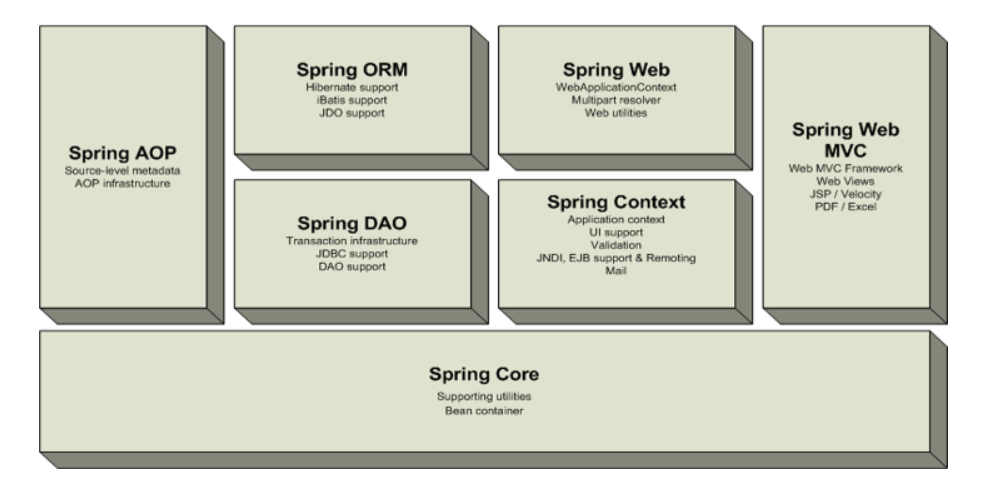
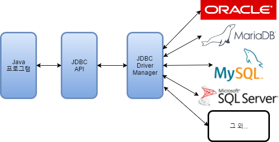
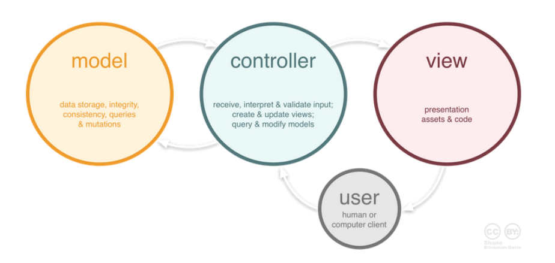
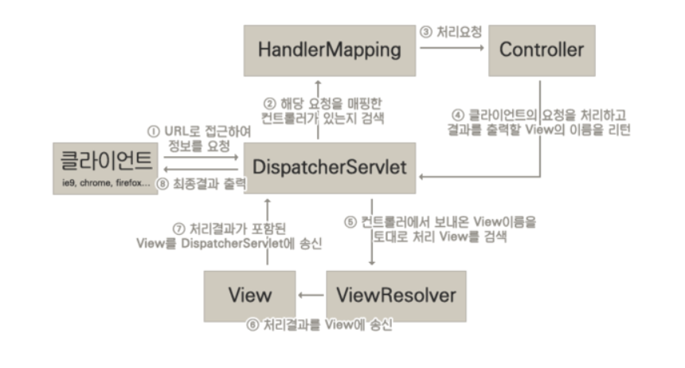
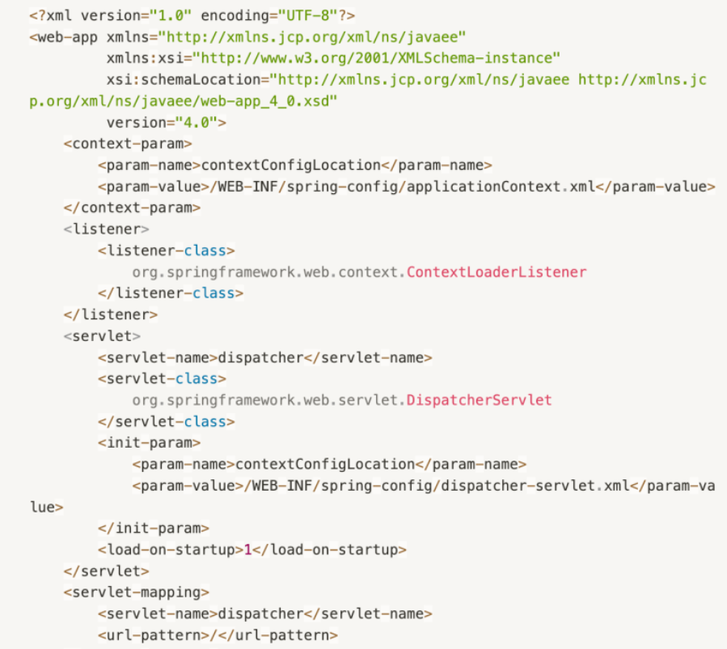
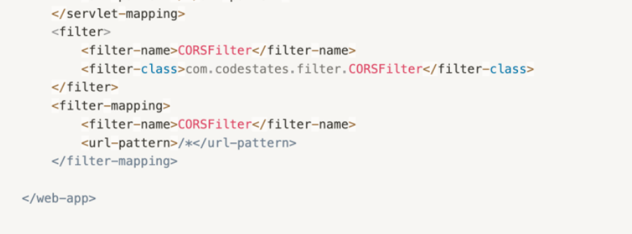
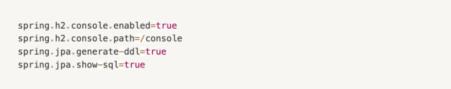

# 1주차-Spring은 무엇일까요? 또, Spring과 SpringBoot의 주요한 차이점은 무엇일까요?

---

---

# Spring은 무엇일까요?

---

> **EJB의 기능을 유지하면서 필요 없는 부분은 없앤, JAVA 기술들을 더 쉽게 사용할 수 있게 해주는 오픈소스 경량급 애플리케이션 프레임워크**
> 

### 오픈소스

스프링은 모든 사용자에게 무료로 열려 있다. 즉, **어떤 개인 및 기업도 스프링을 사용하여 웹 애플리케이션을 개발을 할 수 있으며, 필요하다면 스프링의 코드를 일부 수정하여 사용하여도 무관하다.** 이처럼 오픈소스로 프로젝트를 공개해 놓으면 여러 사람이 프로젝트의 코드를 사용해봄으로써 다양한 검증 과정을 거칠 수 있다는 장점이 있다.

보통의 오픈소스 프레임워크는 뚜렷하게 정해진 인원이 없이 개발과 관리가 이루어지기 때문에 프로젝트의 개발과 개선이 안정적이지 못하다는 단점이 있다.

하지만 스프링은 스프링소스(Spring source) 라는 기업에서 한정적인 인원이 스프링 소스의 수정, 개발에 참여하고 있기 때문에 안정적인 개발과 개선이 보장된다.

### 경량급

이전에 쓰이던 기술(EJB)의 단점을 보완하여 기존에는 불가피하게 작성 해야했던 복잡한 코드를 제거하여 코드의 복잡성을 낮출 수 있다.

보완점 1. 정해진 틀

EJB는 침투적인 코드 라는 단점이 있다. 

- 비즈니스 로직을 더 쉽게 구현하게 위해 만들어졌으나, 서비스가 구현해야 하는 실제 비즈니스 로직보다 EJB 컨테이너를 사용하기 위해 구현해야 하는 상투적인 코드의 양이 더 많다.
- 서비스를 제공하는 기업마다 컨테이너를 구현하는 방법이 달라서 기술 변경에 어려움이 있다.

이를 보완해서 나온 서비스가 Spring 이다.

보완점 2. 고가의 was

EJB는 고가의 was 자바 서버가 있어야 서비스가 돌아가지만 스프링은 JETTY, TOMCAT 등의 가장 단순한 서버 환경에서도 잘 실행된다.

### 엔터프라이즈용 애플리케이션 개발을 편하게 해 주는 애플리케이션 프레임워크

스프링은 애플리케이션을 개발하는데 있어 필요한 모든 업무 분야 및 모든 기술과 관련된 뼈대를 제공한다. 또한 개발자가 실수하기 쉬운 로우레벨 설정을 쉽게 할 수 있어서 개발자가 온전히 개발에만 집중할 수 있도록 해준다.

# Spring은 어떤 구성요소를 포함하고 있나요?

---

### POJO****(Plain Old Java Object)****

기존에 EJB의 의존성 해결 방법: 컨테이너로부터 필요한 객체를 꺼내 사용하는 방법으로 해결.

→비즈니스 로직에 특정 기술이 종속되어버린다.

→교체, 유지보수에 어려움

🌟해결책: 

POJO: 다른 기술을 사용하지 않는 순수한 Java만을 사용하여 만든 객체.(getter, setter로만 구현)

- JAVA 및 JAVA의 스펙에 정의된 기술만을 사용하여 **외부 기술이나 규약의 변화에 얽매이지 않아 보다 유연하게 변화와 확장에 대처할 수 있다.**
- 이를 사용하여 비즈니스 로직을 구현하면 **객체지향 설계를 제한 없이 적용 가능하며, 코드가 단순해져서 테스트와 디버깅에 용이하다.**

POJO을 지향할 때의 원칙

**1. Java나 Java의 스펙에 정의된 것 이외에는 다른 기술이나 규약에 얽매이지 않아야 한다.**

다른 클래스, Getter&Setter 어노테이션을 제외한 기술을 쓰면 애플리케이션의 요구사항이 변경되어 다른 기술로 변경해야 할 때 그 기술을 사용했던 부분들을 모두 제거하여 수정해야 한다.

**2. 특정 환경에 종속적이지 않아야 한다.**

비즈니스 로직을 담고 있는 POJO 클래스는 웹 기반의 환경 정보나 웹 기술을 담고 있는 클래스 또는 인터페이스를 사용하면 안된다.(HTTPServletRequest, 캐시 등)

### PSA****(Portable Service Abstraction, 일관된 서비스 추상화)****

:특정 기술과 관련된 서비스를 추상화하여 일관된 방식으로 사용될 수 있도록 한 것

예시: JDBC

# MVC패턴은 어떤 패턴을 말할까요/ 또, 이 패턴은 어떻게 동작하나요?

: Model-View-Controller의 약자. 어플리케이션을 구성하는 요소를 역할에 따라 세 가지 요소로 나눴다.

1. 모델

어플리케이션의 데이터이며, 모든 데이터 정보를 가공하여 가지고 있는 컴포넌트.

-사용자가 이용하려는 모든 데이터를 가지고 있어야하며, 뷰 또는 컨트롤러에 대한 정보를 알 수 없어야 함.

1. 뷰

시각적인 UI 요소를 지칭.

모델이 가지고 있는 데이터를 저장하면 안된다.

모델이나 컨트롤러에 대한 정보를 알면 안되며, 단순히 표시를 하는 역할이다.

1. 컨트롤러

모델과 뷰를 연결해주는 역할을 한다.

모델 또는 뷰에 대한 정보를 알아야 하고, 모델 또는 뷰의 변경을 인지하여 대처해야한다.

**DispatcherServlet**

---

- Spring Framework가 제공하는 Servlet 클래스
- Spring MVC의 핵심 구성 요소
- 사용자의 Request 을 관리
- Dispatcher가 받은 Request 을 HandlerMapping에게 위임
- Spring 에서는 front controller는 DispatcherServlet 이라고 하고 Controller는 handler 라고 말함

**HandlerMapping**

---

- requestUR과 Controller 클래스의 맵핑을 관리 (@RequestMapping)
- HandlerMapping 인스턴스의 정보로 맵핑된 Controller에게 위임

**Controller**

---

- 요청에 맵핑 된 Controller가 위임됨 (@Controller)
- @RequestMapping 을 통하여 요청을 처리할 메서드에 호출
- 필요한 비즈니스 로직을 호출
- 해당 요청을 처리할 Service를 주입(DI)받아 Service에게 위임 ( @Service )Service에서는 비즈니스 로직을 구현connection pool를 담당하는 DAO가 주입(DI)받아 대신 DB에 접근한다. ( @Repository )결과 데이터를 다시 Controller에 전달
- View에 전달 할 결과 데이터(Model)와 이동할 화면(View) 정보를 스프링 MVC가 제공하는 ModelAndView 인스턴스에 담아 DispatcherServlet에 반환 된다.
- DispatherServlet는 ViewResolver에게 뷰 논리정보(View Name)를 전달

**ModelAndView**

---

- Controller에서 처리 결과를 View에 전달 할 결과 데이터(Model)와 이동할 화면(View) 정보를 담는 클래스
- Controller 메서드에서 리턴 타입이 String 이여도 핸들러에서 ModelAndView 인스턴스에 View 정보를 넣는다.

**ViewResolver**

---

- ViewResolver는 View Name을 이용해 알 맞는 view객체를 찾는다.
- View에 model을 rendering하여 View 인스턴스를 다시 DispatcherServlet에 보냄
- DispathcerServlet은 최종 결과를 클라이언트에 응답

**View**

---

- 결과 데이터인 Model 객체를 보여한다.

# Spring과 SpringBoot의 주요한 차이점은 무엇일까요?

1. 간편한 설정

Spring 상에서는 매우 복잡한 구현이 Spring boot로 넘어가면 아래와 같이 줄어든다.

즉, **스프링 부트는 스프링으로 애플리케이션을 만들 때에 필요한 설정을 간편하게 처리해주는 별도의 프레임워크다.** 스프링 부트를 사용하면 기존에 어려운 초기 설정에 쏟아야 했을 시간과 노력을 절약하여 비즈니스 로직을 구현하는데에 집중할 수 있다.

1. war과 jar의 차이

기존에는 배포를 할 때에 별도의 외장 웹 서버를 설치하고, 프로젝트를 war 파일로 빌드하여 배포를 진행했는데, 이러한 방식은 처리 속도가 느리며 번거롭다는 단점을 가진다. 

반면, 스프링 부트는 자체적인 웹 서버를 내장하고 있어, 빠르고 간편하게 배포를 진행할 수 있다. 또한, 스프링 부트를 사용하면 독립적으로 실행 가능한 Jar 파일로 프로젝트를 빌드할 수 있어, 클라우드 서비스 및 도커와 같은 가상화 환경에 빠르게 배포할 수 있다.

→스프링 부트는 내장 WAS가 있어서 프로젝트를 배포할 때 기본 JDK만 설치하면 바로 배포를 할 수 있다.