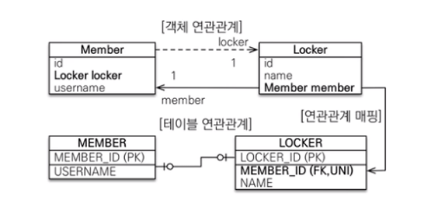

# 연관관계 매핑이란?

- JPA(Java Persistence API)에서 연관관계 매핑은 객체 지향 어플리케이션과 데이터베이스 테이블 간의 관계를 매핑하는 것을 의미합니다.
- JPA는 Java 어플리케이션과 관계형 데이터베이스 간의 상호작용을 더 쉽게 만들어주는 자바의 ORM 기술입니다.

## 연관관계 매핑을 사용하는 이유

jpa의 연관관계 매핑은 객체와 테이블간의 패러다임 차이를 자동으로 처리해주기 때문입니다. RDB의 테이블에서는 연관관계를 구사하기 위하여 외래키를 사용하지만 객체간의 연관관계를 표현하기 위해서는 참조필드를 사용합니다. JPA의 연관관계 매핑은 이러한 패러다임의 차이를 자동으로 처리해 주어 좀 더 객체지향적인 개발을 가능하게 합니다.

```java
@Entity
public class Member {

    @Id 
    @GeneratedValue
    private Long id;
    
    @Column
    private String name;

    @Column
    private Long teamId;
    ...
}

@Entity
public class Team {
    
    @Id 
    @GeneratedValue
    private Long id;

    @Column
    private String name;
}
```
만약 JPA의 연관관계매핑을 사용하지 않는다면 위 코드와 같이 Member클래스에 Team객체의 Id값을 따로 저장해야합니다. 여기서 세 가지 문제점이 발생합니다.

- 객체를 테이블의 구조에 맞게 작성하게 되어 객체지향적인 설계가 불가능하다.
- 데이터 무결성 체크를 개발자가 직접 해줘야 한다.
- 부모객체의 영속성이 변하였을 때 자식객체의 영속성도 수동으로 관리를 해줘야 한다.

데이터 조회 시 Member객체를 읽어와 teamId필드 값을 가져오고 다시 가져온 teamId값을 통해 Team객체를 다시 읽어와야 합니다. 
```java
Member member = memberRepository.findById("1").get();

Team team = teamRepository.findById(member.getId()).get();
```
이는 상당히 번거로우며 JPA의 연관관계 매핑을 사용했을때 보다 추가적이 쿼리가 발생하게 됩니다. 또한 만들어지는 자바클래스가 테이블 구조에 맞게 생성해야하기 때문에 객체지향적인 설계가 힘들다는 단점이 생깁니다.

또한 데이터의 무결성 체크를 개발자가 직접 해줘야 한다는 단점도 생깁니다.
```java
Member member = new Member("박세용","팀 이름");

//  teamId 값이 DB에서 참조 가능한 값인지 모름  
memberRepository.save(member);
```
연관관계 매핑을 사용하지 않으면 데이터를 저장할 때 외래키 값이 참조 가능한 값인지 모르기 때문에 참조 무결성을 지키기 위해서 외래키값이 참조 가능한 지 체크하는 추가적인 쿼리를 작성해야 합니다. 또한 영속성 전이를 개발자가 수동으로 전이시켜줘야 한다는 단점이 생깁니다.

그러나 연관관계 매핑을 사용하면 이와 같은 문제를 JPA가 자동으로 처리해주기 때문에 편리하며 유지보수하기 수월해 집니다.
```java
@Entity
public class Member {

    @Id 
    @GeneratedValue
    private Long id;
    
    @Column
    private String name;

    @ManyToOne
    @JoinColumn(name = "team_id")
    private Team team;
    ...
}

@Entity
public class Team {
    
    @Id 
    @GeneratedValue
    private Long id;

    @Column
    private String name;

    @OneToMany(mappedBy="team",cascade = CascadeType.ALL)
    private List<Member> members
}
========================(데이터 조회)=========================================
// Member객체만 조회를 해도 연관관계에 있는 Team객체까지 조회가 된다.
Member member = memberRepository.findById("1").get();

Team team = member.getTeam();

========================(데이터 저장)=========================================
Team team = new Team("팀1");
Member member = new Member("박세용",team);

/*
    저장할 때 team값이 참조할 수 없는 값이라면 예외가 발생한다.
    또한 영속성 전이 설정을 해두면 team이 참조할 수 없는 값이면 해당 team을 먼저 저장한 뒤 member를 저장한다.
*/ 
memberRepository.save(member);
```
# 연관관계 매핑 시 고려해야 할 것

- ## JPA 단방향과 양방향

RDB는 외래키 하나로 양 쪽 모두 조인을 통한 참조가 가능합니다. 따라서 테이블은 방향이라는 개념이 존재하지 않습니다. 하지만 객체는 참조용 필드가 있는 객체만 다른 객체를 참조하는 것이 가능하기때문에 방향이라는 개념이 존재합니다. 두 객체 사이에 하나의 객체만 참조용 필드를 갖고 참조하면 단방향, 두 객체 모두가 각각 참조용 필드를 갖고 참조하면 양방향 관계라고 합니다. 위의 Member - Team간의 관계는 양방향 관계입니다.

양방향 매핑시 순환참조에 주의해야 합니다. 직렬화 및 toString()메소드는 getter메소드를 호출하게 되는데 양방향 매핑인 경우 각 객체가 서로를 호출하게되어 순환참조문제가 발생하게 됩니다. 순환참조를 예방하기 위해서 각 layer간의 데이터 전송 시 DTO를 사용하며 @ToString(exclude = "team")과 같이 toString()메소드에 연관관계로 연결된 객체를 제외시켜줘야 합니다.


### 양방향 관계만 사용하면 안되는 이유

개발자 입장에서는 양방향,단방향을 구분하지 않고 양방향으로만 설계를 하면 편하지만 객체 입장에서 양방향 매핑을 하면 오히려 복잡해질 수 있습니다. 불필요한 양방향 매핑은 클래스의 크기를 불필요하게 크게만들며 복잡하게 만듭니다. 예를 들어 사용자 Entity는 다른 엔티티들과 연관관계를 가진다면 모든 연관관계에 대해 양방향 관계를 설정하면 사용자 Entity가 엄청나게 복잡해질 것입니다.

따라서 각 엔티티가 서로 참조할 일이 많으면 양방향, 그렇지 않고 한쪽이 일방적으로 한쪽을 참조할 경우가 많으면 단방향 설계를 하는것이 유리합니다.

- ## 연관관계의 주인

연관관계의 주인이란 연관관계를 맺은 객체 중 외래키를 관리하는 객체를 지정해 주는 것을 의미합니다. 즉, 제어의 권한(데이터 조회, 저장, 수정, 삭제)를 갖는 실질적인 객체가 무엇인지 JPA에게 알리는 것입니다. 따라서 연관관계의 주인은 연관 관계를 갖는 두 객체 사이에서 조회, 저장, 수정, 삭제를 할 수 있지만, 주인객체가 아닌 객체는 조회만 가능하게 됩니다. 이를 통해 데이터 조회, 저장, 수정, 삭제 시 영속성 컨텍스트의 변경감지를 어느 객체에서 할 것인지 정하 

연관관계의 주인이 아닌 객체는 mappedBy 속성을 사용해 주인을 지정해주면 됩니다.보통 데이터베이스에 외래키가 저장되는 엔티티가 연관관계의 주인객체가 됩니다.
```java
// mappedBy 속성을 통해 주인객체를 지정
@OneToMany(mappedBy="team",cascade = CascadeType.ALL)
    private List<Member> members
}
```
### 연관관계의 주인을 지정해야 하는 이유
패러다임의 차이

예를 들어 (Member, Team)이 있고 양방향 연관 관계를 갖는다고 하면 이 상황에서 Member를 다른 Team으로 수정하려고 할 때 Member 객체에서 changeTeam() 같은 메서드로 수정해야하는지, Team 객체에서 getMemberList()로 member List 객체를 꺼내 수정해야하는지의 문제가 발생하게 됩니다. 

객체 패러다임에서는 두 방식 다 옳지만, 테이블의 패러다임에서는 외래키가 저장되는 테이블에서 수정쿼리를 수행해야합니다. 따라서 주인객체를 정해 어느 객체를 통해 데이터를 제어할 지 명시하여 이러한 패러다임의 차이를 해결할 수 있습니다.

- ## 다중성
연관관계 매핑을 할 떄 각 객체간의 관계에 따라 다대일(N:1), 일대다(1:N), 일대일(1:1), 다대다(N:M)매핑을 해줘야 합니다.
```java
//다대일(N:1)     일대다(1:N)
@ManyToOne        @OneToMany

//일대일(1:1)     다대다(N:M)
@OneToOne         @ManyToMany
```
### @ManyToOne
@ManyToOne 매핑은 다대일 관계 중 N쪽에 위치한 객체에 선언되는 어노테이션입니다. JPA에서는 DB에서 외래키는 N쪽 객체에 저장이 되기 때문에 주인객체를 N쪽 객체로 지정하는 것을 권장합니다.

주인객체에서는 mappedBy속성을 사용하지 않으며 주인객체가 아닌 객체만 mappedBy속성을 통해 주인객체를 지정해줍니다.

이 @ManyToOne매핑은 단방향과 양방향 모두 문제없이 사용이 가능합니다.


```java
@Entity
public class Member {

    @Id 
    @GeneratedValue
    private Long id;
    
    @Column
    private String name;

    @ManyToOne
    @JoinColumn(name = "team_id")
    private Team team;
    ...
}
```
### @OneToMany
@OneToMany매핑은 다대일관계중 1쪽에 위치한 객체에 선언되는 어노테이션입니다. 테이블에는 다대일 관계에서 항상 다쪽에서 외래키가 저장됩니다. 따라서 JPA스펙 상  OneToMany가 주인객체가 될 수는 있지만 1쪽 객체가 주인이 되면 주인객체가 관리하는 외래키값이 다른 테이블의 외래키로 등록되어지며 관리하기 힘들어지게 됩니다. 또한 외래키가 다른 테이블에 있기 때문에 A객체를 수정했더니 다른 B객체와 매핑돼있는 테이블에 추가로 Update쿼리가 나가게 되는 단점이 있습니다.

따라서 OneToMany가 주인객체가 되는것은 지양해야하며 같은 이유로 OneToMany는 단방향으로 연결하는 것 또한 지양됩니다. 따라서 OneToMany매핑에서 1쪽 객체가 N쪽 객체를 일방적으로 참조하는 관계일 지라도 단방향이 아닌 양방향연결을 하는 것이 권장되고있습니다.
```java
@Entity
public class Team {
    
    @Id 
    @GeneratedValue
    private Long id;

    @Column
    private String name;

    @OneToMany(mappedBy="team",cascade = CascadeType.ALL)
    private List<Member> members
}
```
### @ManyToMany


@ManyToMany매핑은 다대다관계일 때 사용되는 어노테이션 입니다. 관계형 데이터베이스는 정규화된 테이블 2개로 다대다 관계를 표현할 수 없기때문에 JPA는 다대다관계를 조인테이블을 사용하여 객체와 테이블을 매핑합니다. 그러나 실무에서 @ManyToMany 매핑은 사용하기에는 한계가 있습니다.
- 조인 테이블은 단순히 연결만 하고 끝나지 않습니다.
- 조인 테이블에 추가 정보를 필요로 할 때 가 있습니다.
- 또한, 조인 테이블이 숨겨져 있기 때문에 예상하지 못한 쿼리들이 실행됩니다.
  


위 그림과 같이 Member - Product가 다대다 관계로 연결되었다고 가정하면 JPA는 자동으로 Member_Product라는 조인테이블을 생성합니다. 그러나 이 조인테이블에는 Member와 Product객체의 외래키만 저장이 가능합니다. 그러나 실제 개발시에는 주문량, 주문일자 등 조인테이블에서 추가적으로 관리해야 하는 정보들이 생기는데 조인테이블에는 외래키만 저장이 가능하므로 문제가 발생합니다. 그렇다고 주문량,주문일자 데이터를 Product테이블에 저장하게 되면 조회쿼리연산의 성능이 저하 되며 새로운 제품을 추가하게 될 경우 주문량과 주문일자의 값을 Null로 집어넣어야 하는 등 정규화 되지 않은 테이블로 인해 이상현상이 발생할 수 있다는 문제점이 있습니다.

또한 객체입장에서는 조인테이블이 숨겨져 있기때문에 관리하기 어렵다는 단점이 있습니다.

### 해결법
이러한 다대다매핑의 문제점을 해결하기 위해서는 조인테이블을 엔티티로 승격시키는 방법을 사용할 수 있습니다. 


위 그림과 같이 조인테이블을 엔티티로 승격시켜 (Member - ORDER)는 일대다, (ORDER - Product)는 다대일 관계로 쪼개어 표현하면 다대다 관계를 위의 문제점 없이 표현이 가능합니다. 이 또한 N쪽 객체인 조인엔티티가 주인객체가 되어야 합니다.
```java
@Entity
public class Member {

    @Id
    @Column
    private Long id;

	// 연결 테이블(MEMBER_PRODUCT)쪽이 외래키를 갖고있기 때문에, 연결 테이블이 연관관계의 주인이다.
    @OneToMany(mappedBy = "member") 
    private List<MemberProduct> memberProducts;

    @Column
    private String username;

}

@Entity
public class Product {
	
    @Id
    @Column
    private Long id;
    
    // 연결 테이블(MEMBER_PRODUCT)쪽이 외래키를 갖고있기 때문에, 연결 테이블이 연관관계의 주인이다.
    @OneToMany(mappedBy = "product") 
    private List<MemberProduct> memberProducts;

    @Column
    private String name;

}

@Table(name = "ORDERS")
@Entity
public class MemberProduct {

    @Id
    @Column
    private Long id;
    
    @ManyToOne
    @JoinColumn(name = "MEMBER_ID")
    private Member member;

    @ManyToOne
    @JoinColumn(name = "PRODUCT_ID")
    private Product product;
    
    @Column
    private Integer orderAmount;

    @Column
    private LocalDateTime orderDate;
}
```

### @OneToOne
@OneToOne의 경우 일대일 관계일 때 사용되며 두개의 테이블 중 어느 곳에서든 외래키를 보유할 수 있습니다 ManyToOne과 다른점은 외래키에 유니크 제약조건 즉, 관계를 맺는 두 엔티티 간의 관계가 한쪽 방향으로만 맺어질 수 있도록 강제하는 제약 조건이 붙습니다. 그런데 문제는 외래키를 어느 곳으로 설정하냐에 따라 연관관계의 주인이 변경되기때문에 연관관계의 주인은 항상 자신의 테이블에 외래키가 있는 경우에만 할 수 있습니다.(타 테이블에 외래키가 있을 경우 연관관계의 주인이 될 수 없음) 


Member객체와 Locker객체가 있고 한명의 Member가 하나의 Locker만을 가질 수 있고 하나의 Locker는 한명의 Member한테만 배정이 될 수 있다고 가정해보겠습니다. 

일대일 관계에는 주 테이블과 대상 테이블이 관계를 맺습니다. 여기서 주 테이블이란 해당 관계에서 주체가 될 수 있는 대상 (Member)이며 대상 테이블은 해당 관계에서의 주체에 의해 관계가 맺어지는 대상 (Locker)이 됩니다. 

일대일 관계는 주 테이블이나 대상 테이블 둘 중 어느 곳이나 외래키를 가질 수 있습니다.

주 테이블에 외래키 저장
- 객체지향 개발자들이 선호한다.
- 외래 키에 해당하는 대상 테이블을 객체 참조와 비슷하게 사용할 수 있기 때문
- 그러나 주 테이블에 연결된 대상테이블이 존재하지 않을 경우 NULL값이 들어간다는 단점이 있음. 
  
대상 테이블에 외래키 저장
- 데이터베이스 개발자들이 선호합니다.
- 테이블 관계를 일대일 (1:1)에서 일대다 (1:N)으로 변경할 때, 테이블 구조를 그대로 유지할 수 있습니다.
- JPA에서 단방향을 지원하지 않아 양방향매핑이 강요된다.
- 지연로딩이 안됨.

### 주테이블에서 외래키 관리
이 경우 주 테이블인 Member가 외래키를 관리하는 주인객체이므로 다음과 같이 코드를 작성해 주면 됩니다. 


```java
@Entity
public class Member {
  ...
       
   @OneToOne
   @JoinColumn(name = "locker_id")
   private Locker locker;

  ...
}

@Entity
public class Locker {
  ...
    // 단방향일 경우에 생략
   @OneToOne(mappedBy = "locker")
   private Member member;
}
```

### 대상테이블에서 외래키 관리
이 경우에는 위 코드에서 mappedBy만 거꾸로 바꾸면 됩니다. 그러나 대상테이블에서 외래키를 관리할 경우 JPA의 단방향 매핑이 지원되지 않습니다. 따라서 양방향 매핑이 강제되며 JPA가 제공하는 기본 프록시 기능의 한계로 지연 로딩으로 설정해도 항상 즉시 로딩 된다는 단점이 있습니다.

- 주테이블에서 외래키를 관리하는 경우 주테이블 조회 시 외래키를 통해 참조무결성 검사를 진행하게됩니다. 그러나 대상테이블에서 외래키를 관리하게되면 주테이블에 외래키가 없기때문에 참조무결성 검사를 하기위해서 대상테이블에 쿼리를 날려 확인해야합니다. 따라서 지연로딩을 사용해도 대상테이블에 쿼리가 발생하기 때문에 항상 즉시로딩이 됩니다.




# 영속성 전이는 무엇이고 어떻게 활용할 수 있을까요?
영속성 전이 (CASCADE) 란 특정 엔티티를 영속성 상태로 만들때 연관관계가 연결된 엔티티도 함께 영속성 상태로 변경 하는 것을 말합니다. 즉, 부모 엔티티의 상태 변화가 자식 엔티티에 영향을 미치는 것을 자동으로 처리하는 것을 의미합니다. 영속성 전이를 사용하면 일일이 관련된 모든 엔티티에 대해 상태 변화를 수동으로 처리하지 않아도 되며 이를 통해 개발자는 더 쉽게 엔티티들을 다룰 수 있고, 불필요한 반복 작업을 줄일 수 있습니다. 
1. CascadeType.ALL: 모든 상태 변화(추가, 수정, 삭제)를 자식 엔티티에게 전파합니다.

2. CascadeType.PERSIST: 새로운 엔티티를 추가할 때만 자식 엔티티에게 전파합니다.

3. CascadeType.MERGE: 엔티티를 병합(merge)할 때만 자식 엔티티에게 전파합니다.

4. CascadeType.REMOVE: 엔티티를 삭제할 때만 자식 엔티티에게 전파합니다.

5. CascadeType.REFRESH: 엔티티를 리프레시(refresh)할 때만 자식 엔티티에게 전파합니다.

6. CascadeType.DETACH: 엔티티를 Detach할 때만 자식 엔티티에게 전파합니다.

만약 Board - Reply가 일대다 관계로 연결되어있을 때 만약 영속성 전이 설정을 해 주지않으면 Board객체가 삭제되면 해당 Board객체와 연결된 Reply객체를 하나하나 삭제해 줘야했지만 영속성 전이 설정을 해주면 자동으로 부모엔티티의 영속성이 전이되어 자동으로 삭제가 됩니다.
```java
Team team = new Team("팀1");
Member member = new Member("박세용",team);

memberRepository.save(member);
```
또한 만약 위 코드에서 team객체가 DB에 저장되어 있지 않다고 하면 영속성 전이설정을 하지 않으면 예외가 발생합니다. 그러나 CascadeType.PERSIST로 설정해두면 team이 DB에 저장되어있지 않더라도 team이 먼저 저장이 되고 그 뒤에 member객체가 저장이 됩니다.

### cascade와 orphanRemoval의 차이
cascade는 부모엔티티의 영속상태를 자식엔티티에게 전파하는 속성을 의미합니다. 그러나 cascade는 부모엔티티와 자식엔티티간의 연관관계가 끊어졌을 경우에는 자식엔티티가 삭제되지 않습니다. 이때 연관관계가 끊어졌을 때 자식엔티티를 삭제하고 싶다면 orphanRemoval=true로 해 두면 됩니다.

# 지연로딩, 즉시로딩


즉시로딩은 특정 엔티티를 조회할 때 엔티티와 연관관계가 있는 엔티티도 한번에 같이 조회하는 것을 의미하며 지연로딩은 연관관계에 있는 엔티티의 조회를 미뤄두었다가 필요할 때 조회를 하는 로딩방법입니다. 지연로딩을 통해 불필요한 데이터를 가져오지 않아 성능상 유리할 수 있습니다. 그러나 두 객체의 정보가 모두 필요한 경우 지연로딩보다 즉시로딩이 성능상 좋기때문에 무조건 지연로딩이 유리한 것이 아니며 연관관계의 특성에 맞게 어떤 로딩방법을 사용할 건지 선택해야합니다. 만약 연결된 두 객체의 정보가 동시에 필요한 요청이 많이 들어온다면 즉시로딩을 사용하는 것이 유리하며 그렇지 않다면 즉시로딩이 더 유리할 것 입니다.

지연로딩을 사용하면 내부적으로 프록시객체를 사용하며 프록시객체는 실제 엔티티를 상속받아 만들어집니다. 그러다 만약 실제 엔티티를 조회하는 요청이 들어오면 프록시는 영속성컨텍스트를 조회하며 1차캐시에 없다면 데이터베이스를 조회하여 1차캐시에 저장하고 그 뒤 저장된 1차캐시로부터 실제 엔티티를 생성하게됩니다. 이렇게 필요할 때 데이터베이스를 조회하여 실제 엔티티를 생성하는 것을 프록시 초기화라고부릅니다. 이렇게되면 프록시는 사라지거나 프록시가 실제 엔티티가 되는것이아닌 프록시와 실제 엔티티가 같이 존재하게 되며 프록시 초기화가 완료되면 프록시를 통해 실제엔티티에 접근합니다.

지연로딩방식에서는 영속성 컨텍스트가 존재해야만 합니다. 그러나 JPA는 DB조회가 끝나면 영속성 컨텍스트가 없어지므로 지연로딩 사용 시 모든 작업을 트랜잭션 단위로 묶어주어야 합니다. (트랜잭션 생존주기와 영속성컨텍스트의 생존주기가 같기때문)