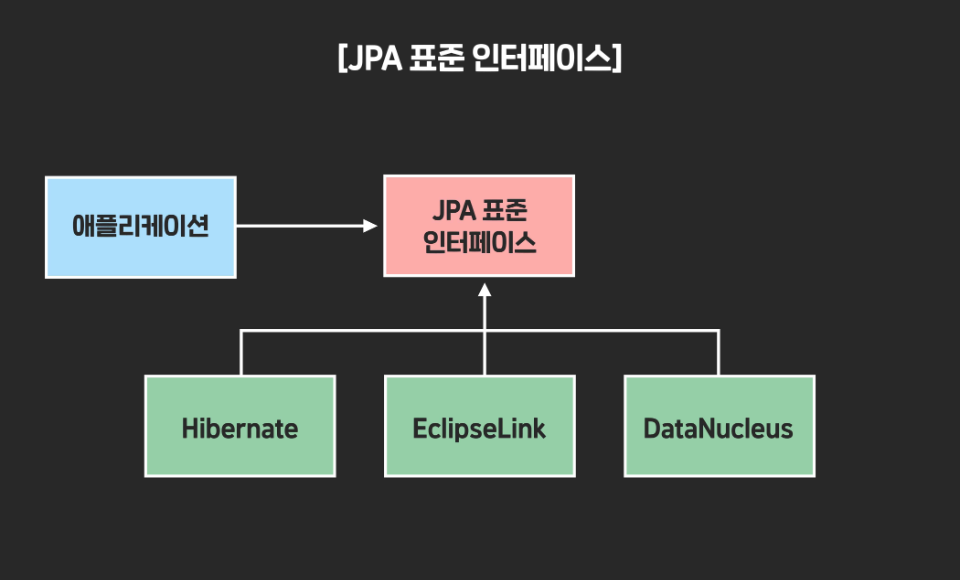
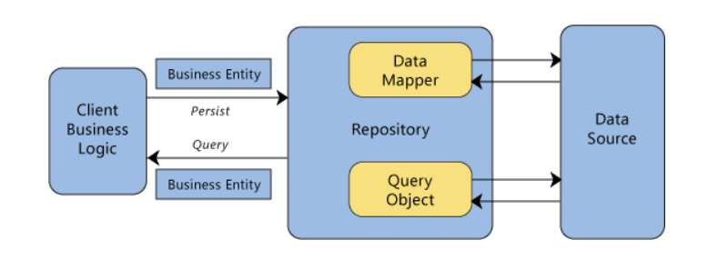

# 2주차-ORM은 무엇일까요? 스프링에서 ORM을 어떻게 이용할 수 있을까요?

---

---

# 1. ORM은 무엇이고 왜 필요할까요?

---

ORM(Object Relational Mapping, 객체 관계 매핑):

> 객체(Object)와 DB의 테이블을 Mapping 시켜 RDB 테이블을 객체지향적으로 사용하게 해주는 기술
> 

관계형 데이터베이스의 특징: 

- 테이블과 열의 형태로 데이터를 저장, 관리
- 객체지향언어의 특징(상속, 다형성, 레퍼런스 등)이 없음

객체지향언어: 

- 데이터와 해당 데이터에 대한 동작을 하나의 단위인 객체로 캡슐화.

→ 둘 사이에 필연적인 차이 발생

ORM을 통해 객체 간의 관계를 바탕으로 SQL문을 자동으로 생성하여 불일치 해결.

→ ORM을 이용하면 따로 SQL문을 짤 필요 없이 객체를 통해 간접적으로 데이터베이스를 조작할 수 있게 된다.

-객체 모델과 관계형 모델 간에 불일치

1. 세분성(Granularity)
    
    경우에 따라서 데이터베이스에 있는 테이블 수보다 더 많은 클래스를 가진 모델이 생길 수 있다.
    
2. 상속성(Inheritance)
    
    RDBMS는 객체지향 프로그래밍 언어의 특징인 상속 개념이 없다.
    
3. 일치(Identity)
    
    RDBMS는 기본키를 이용하여 동일성을 정의하지만 자바는 객체 식별(a==b)와 객체 동일성(a.equals(b))를 모두 정의한다.
    
4. 연관성(Associations)
    
    객체지향 언어는 연관성에 방향성이 있지만(객체의 참조)
    
    RDBMS는 방향성이 없는 외래키를 이용해서 나타낸다.
    
5. 탐색(Navigation)
    
    자바와 RDBMS에서 객체를 접근하는 방법이 근본적으로 다르다. 자바는 그래프형태로 하나의 연결에서 다른 연결로 이동하며 탐색한다. 그러나 RDBMS에서는 일반적으로 SQL문을 최소화하고 Join을 통해 여러 엔티티를 로드하고 원하는 대상 엔티티를 선택하는 방식으로 탐색한다.
    

ORM의 장점

1. **완벽한** **객체 지향적인 코드**
    - SQL문이 아닌 클래스의 메서드를 통해 데이터베이스를 조작할 수 있다.
    - SQL문을 사용하면서 같이 필요한 선언문, 할당, 종료 같은 부수적인 코드가 줄어든다.
    - 객체에 대한 코드를 별도로 작성하여 코드의 가독성을 높힐 수 있다.
        
        →이로 인해 **재사용 및 유지보수의 편리성**이 증가한다.
        
2. DBMS에 대한 종속성이 줄어든다.
    - 객체 간의 관계를 바탕으로 SQL문을 자동으로 생성한다.
    - 객체의 자료형 타입을 데이터베이스에 맞게 자동 변환해준다.
        
         → **Database가 변경되는 작업등에 대해 적은 리스크를** 가집니다.
        

ORM의 단점

1. **모든 것을 ORM으로 할 수는 없다.** 
    - 프로젝트의 복잡성이 커질 수록 난이도가 올라간다.
    - 설계의 문제로 잘못 구현되었을 경우 속도 저하, 일관성 붕괴의 문제가 생긴다.
    - 일부 SQL문은 ORM으로 쓰기엔 속도가 느려 결국 SQL문을 직접 써야할수도 있다.
2. 이미 한방 쿼리나, 프로시저가 많은 시스템에서는 이들을 다시 객체로 변경해야 하며, 그 과정에서 생산성 저하와 리스크가 많이 발생할 수 있다.
3. **올바르게 Database와 ORM을 이해하지 않고 사용하기에는 장애 위험이** 크다.

# 2. 스프링에서 ORM을 어떻게 활용하나요?

---

### 번외. 왜 MyBatis는 안 쓰고 JPA를 쓸까?

MyBatis의 예시 코드는 다음과 같다.

```jsx
@Mapper
@Repository
public interface UserMapper {
    insertUser(User user);
}
```

```jsx
<?xml version="1.0" encoding="UTF-8"?>
<!DOCTYPE mapper PUBLIC "-//mybatis.org//DTD Mapper 3.0//EN" "http://mybatis.org/dtd/mybatis-3-mapper.dtd">

<mapper namespace="mang.blog.user.userMapper">

    <insert id="insertUser" parameterType = "user">
        INSERT USER(
            email, name, pw, 
        )VALUES(
            #{email}, #{name}, #{pw}
        )
    </insert>

</mapper>
```

**SQL Mapper**: Object와 SQL의 필드를 매핑하여 데이터를 객체화 하는 기술

- 객체와 테이블 간의 관계를 매핑하지 않음
- SQL문을 직접 작성하고 쿼리 수행 결과를 어떠한 객체에 매핑할지 바인딩 하는 방법
    
    →데이터베이스에 종속적이게 된다.
    

**MyBatis(SQL Mapper):** 

- 자바에서 SQL Mapper를 지원해주는 프레임워크
- SQL문을 이용해서 RDB에 접근, 데이터를 객체화 시켜줌
- SQL을 직접 작성하여 쿼리 수행 결과를 객체와 매핑
- 쿼리문을 xml로 분리 가능
- 복잡한 쿼리문 작성 가능
- 데이터 캐싱 기능으로 성능 향상
- but 객체와 쿼리문 모두 관리해야함, CRUD 메소드를 직접 다 구현해야함.

MyBatis의 장점은 쿼리를 직접 작성할 수 있어 복잡한 쿼리를 작성할 수 있고, 속도가 빠르고 ORM 기술보다 습득이 빠르다는 장점이 있지만

- ORM(JPA)도 QueryDSL을 사용하여 직접 쿼리 작성이 가능하다.
- ORM은 DB에 객체지향적으로 접근 가능하다.
- DB에 대한 종속성이 심하지 않아서 적은 수정으로도 DB변경이 가능하다.
- SQL문을 직접 작성할 필요 없이 JPA가 알아서 작성해준다

이런 점 때문에 쓰이지 않게 되었다.

## A. Spring Data JPA란 무엇일까요?



**JPA VS Spring Data JPA**

> JPA: 자바 어플리케이션에서 관계형 데이터베이스를 사용하는 방식을 정의한 인터페이스
> 

JPA는 단순히 명세이기 때문에 구현이 없다. JPA를 정의한 `javax.persistence` 패키지의 대부분은 interface, enum, exception 그리고 각종 어노테이션으로 이루어져 있다. 예를 들어, JPA의 핵심이 되는 `EntityManager`는 아래와 같이 `javax.persistence.EntityManager` 라는 파일에 interface로 정의되어 있다.

```jsx
package javax.persistence;

import ...

public interface EntityManager {

    public void persist(Object entity);

    public <T> T merge(T entity);

    public void remove(Object entity);

    public <T> T find(Class<T> entityClass, Object primaryKey);

    
}
```

> Spring Data JPA: Spring에서 제공하는 모듈 중 하나로, 개발자가 JPA를 더 쉽고 편하게 사용할 수 있도록 도와준다.
> 

JPA를 한 단계 추상화시킨 Repository 인터페이스를 제공함으로써 이루어진다.

## B. Repository Layer란 무엇일까요?

> 데이터를 저장하고 불러오는 로직을 담당하는 객체
> 



비즈니스 로직은 프로그램의 핵심이 되는 요소이며, 비즈니스 로직을 잘 짜야 원하는 결과를 올바르게 도출할 수 있다. 이때 비즈니스 로직은 보통 데이터베이스나 웹서비스 등의 데이터 저장소에 접근하게 되는데 이 과정에서 여러 문제가 발생할 수 있다. 주로 중복되는 코드, 오류를 발생할 가능성이 있는 코드, 오타, 비즈니스 로직 테스트의 어려움 등이 있다.

이를 해결하기 위해선

(1) 비즈니스 로직과 데이터 레이어를 **분리**해야 한다.

(2) 중앙 집중 처리 방식을 통해 **일관된 데이터와 로직**을 제공해야 한다.

그래서 Repository Layer가 생기게 되었다.

Repository Layer의 특징:

- 데이터 소스 레이어와 비즈니스 레이어 사이를 중재한다.
- 데이터 소스에 쿼리를 날리거나, 데이터를 다른 domain에서 사용할 수 있도록 새롭게 mapping 할 수 있다.
- 데이터가 있는 여러 저장소(Local Data Source, Remote Data Source)를 추상화하여 **중앙 집중 처리 방식**을 구현할 수 있다
- 데이터를 사용하는 Domain에서는 **비즈니스 로직에만 집중**할 수 있다.
    
    ex) ViewModel에서는 데이터가 로컬 DB에서 오는지, 서버에서 API 응답을 통해 오는 것인지 **출처를 몰라도 된다.** Repository를 참조하여 Repository가 제공해주는 데이터를 이용하기만 하면 된다.
    
- Repository가 추상화되어 있으므로 **항상 같은 Interface**로 데이터를 요청할 수 있다. ViewModel이 여러 Repository를 공유하더라도 일관된 Interface를 통해 데이터의 일관성 또한 유지할 수 있다.

이로 인해 얻을 수 있는 이점:

1. 데이터 로직과 비즈니스 로직을 분리할 수 있다
2. Domain에서는 일관된 인터페이스를 통해 데이터를 요청할 수 있다.
3. 데이터 저장소의 데이터를 캡슐화할 수 있다. **객체지향**적인 프로그래밍에 더 적합하다.
4. 단위 테스트를 통한 검증이 가능하다.
5. 객체 간의 결합도가 감소한다.
6. 어플리케이션의 전체적인 디자인이 바뀌더라도 적용할 수 있는 유연한 아키텍쳐이다.

## C. JpaRepository 인터페이스에는 어떤 기능들이 포함되어 있나요?

> Spring Data JPA에서 제공하는 인터페이스 중 하나로, JPA를 사용하여 데이터베이스를 조작하기 위한 메서드들을 제공한다.
> 

JPARepository 인터페이스를 상속받는 인터페이스를 정의하면, 해당 인터페이스를 구현하는 클래스는 JPA에서 제공하는 메서드들을 사용할 수 있다.

데이터베이스의 추가, 조회, 수정, 삭제의 findAll(), findById(), save() 등의 메서드들을 사용할 수 있고, 제공되는 메서드들 이용하여 쉽고 간편하게 CRUD 조작을 할 수 있습니다.

즉, JpaRepository를 사용하면, 복잡한 JDBC(Java DataBase Connectivity) 코드를 작성하지 않아도 간단하게 DB와의 데이터 접근 작업을 처리할 수 있다.

JPARepository 인터페이스는 제네릭 타입을 사용하여 Entity클래스와 복합키를 사용하고 있다면 해당 Entity의 ID클래스를 명시한다. 이를 통해 해당 인터페이스를 상속받는 구현체는 Entity클래스와 ID클래스에 대한 정보를 알고 있어서, 런타임 시점에 적절한 쿼리를 생성하고 실행할 수 있다.

-ORM을 쓰지 않고 JDBC로 Mysql을 쓸 때:

```jsx
public void insertUser(User user){
    String query = " INSERT INTO user (email, name, pw) VALUES (?, ?, ?)";

    PreparedStatement preparedStmt = conn.prepareStatement(query);
    preparedStmt.setString (1, user.getEmail());
    preparedStmt.setString (2, user.getName());
    preparedStmt.setString (3, user.getPW());

    // execute the preparedstatement
    preparedStmt.execute();
}
```

사용자 데이터를 추가하는 코드인데, Java Object와 RDB가 Mapping 되지 않기 때문에 각각의 쿼리 파라미터에 사용자 데이터를 직접 Set해서 DB에 저장하고 있다. 이러한 코드는 상당히 가독성이 떨어지며 작업이 불편하다.

-JpaRepository 구현체

```jsx
package org.springframework.data.jpa.repository.support;

import ...

public class SimpleJpaRepository<T, ID> implements JpaRepositoryImplementation<T, ID> {

    private final EntityManager em;

    public Optional<T> findById(ID id) {

        Assert.notNull(id, ID_MUST_NOT_BE_NULL);

        Class<T> domainType = getDomainClass();

        if (metadata == null) {
            return Optional.ofNullable(em.find(domainType, id));
        }

        LockModeType type = metadata.getLockModeType();

        Map<String, Object> hints = getQueryHints().withFetchGraphs(em).asMap();

        return Optional.ofNullable(type == null ? em.find(domainType, id, hints) : em.find(domainType, id, type, hints));
    }

    // Other methods...
}
```

JPARepository 사용법

1. Entity 클래스 정의

```jsx
@Table("user_tb")
@Getter
@Entity
public class User {
    @Id
    @GeneratedValue(strategy = GenerationType.IDENTITY)
		/*
		AUTO
		SEQUENCE
		IDENTITY
		TABLE
		*/
    private Long id;
    private String name;
    private Integer age;
}
```

**@Id**

primary key를 가지는 변수를 선언하는 것을 뜻한다. @GeneratedValue 어노테이션은 해당 Id 값을

어떻게 자동으로 생성할지 전략을 선택할 수 있다. 

**@Table**

별도의 이름을 가진 데이터베이스 테이블과 매핑한다. 기본적으로 @Entity로 선언된 클래스의 이름은 실제 데이터베이스의 테이블 명과 일치하는 것을 매핑한다. 따라서 @Entity의 클래스명과 데이터베이스의 테이블명이 다를 경우에 @Table(name=" ")과 같은 형식을 사용해서 매핑이 가능하다.

**@Column**

@Column 선언이 꼭 필요한 것은 아니다. 하지만 @Column에서 지정한 변수명과 데이터베이스의 컬럼명을

서로 다르게 주고 싶다면 @Column(name=" ") 같은 형식으로 작성하면 된다.

그렇지 않은 경우에는 기본적으로 멤버 변수명과 일치하는 데이터베이스 컬럼을 매핑한다

1. JpaRepository 인터페이스를 상속받는 인터페이스 생성
    
    ```jsx
    public interface UserRepository extends JpaRepository<User, Long> {
    
        @Query("SELECT u FROM User u WHERE u.age >= :age")
        List<User> findByAgeGreaterThanEqual(@Param("age") Integer age);
    
    		Optional<User> findById(Long Id);
    }
    ```
    
    Entity클래스를 작성했다면 이번엔 Repository 인터페이스를 만들어야 한다.
    
    스프링부트에서는 Entity의 **기본적인 CRUD가 가능하도록 JpaRepository 인터페이스**를 제공한다. Spring Data JPA에서 제공하는 **JpaRepository 인터페이스를 상속하기만 해도 되며**, 
    
    인터페이스에 따로 @Repository등의 어노테이션을 추가할 필요가 없다.
    
    JpaRepository를 상속받을 때는 사용될 Entity 클래스와 ID 값이 들어가게 된다.
    
    →**JpaRepository<T, ID>** 가 된다.
    
    그렇게 JpaRepository를  단순하게 상속하는 것만으로 위의 인터페이스는 Entity 하나에 대해서
    
    아래와 같은 기능을 제공하게 된다. 
    
    
    
    이외의 기능은 위의 예제처럼 규칙에 맞게 선언해야 한다.
    
    
    
    아래는 @Query 메소드에 포함 가능한 규칙이다.
    
    
    
2. Spring Bean 등록

```jsx
@Service
public class UserService {
    @Autowired
    private UserRepository userRepository;
    
```

1. JpaRepository에 등록된 메소드 사용

```jsx
@Service
public class UserService {

    @Autowired
    private UserRepository userRepository;

    public User saveUser(User user) {
        return userRepository.save(user);
    }

    public List<User> getAllUsers() {
        return userRepository.findAll();
    }

		public Optional<User> getUserById(Long id) {
        return userRepository.findById(id);
    }
}
```

JpaRepository method

[https://docs.spring.io/spring-data/jpa/docs/current/api/org/springframework/data/jpa/repository/JpaRepository.html](https://docs.spring.io/spring-data/jpa/docs/current/api/org/springframework/data/jpa/repository/JpaRepository.html)