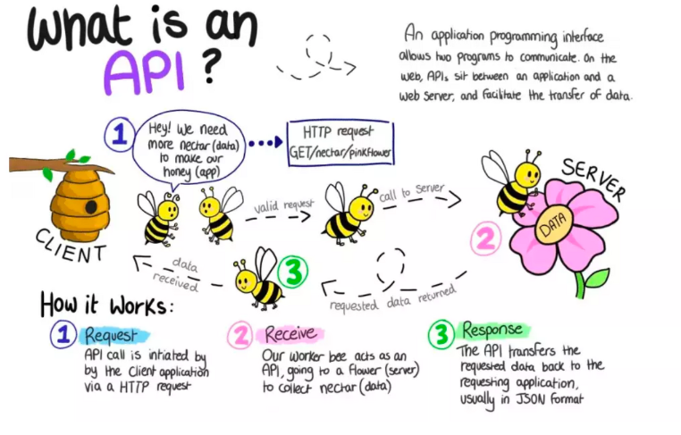
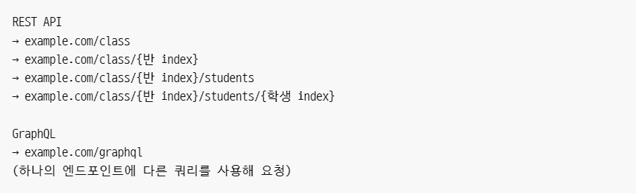
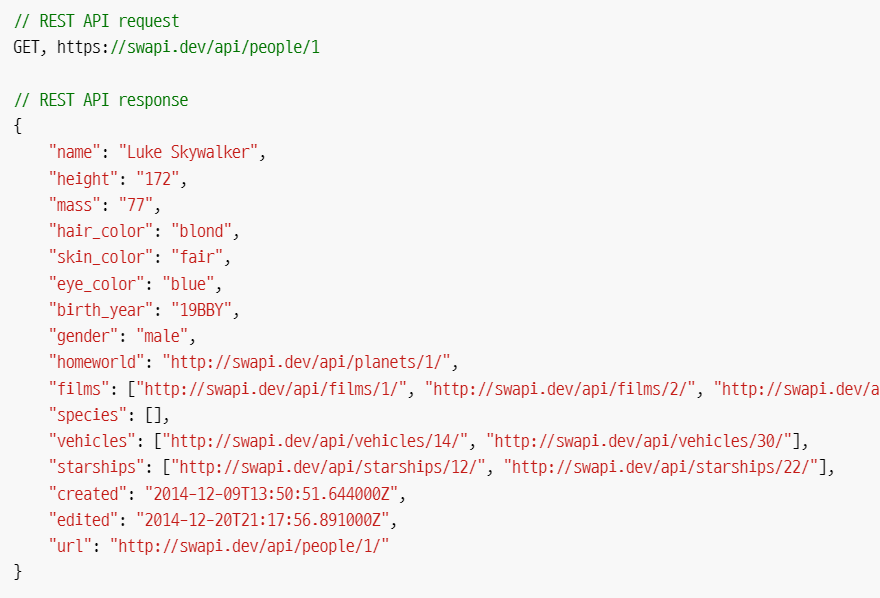
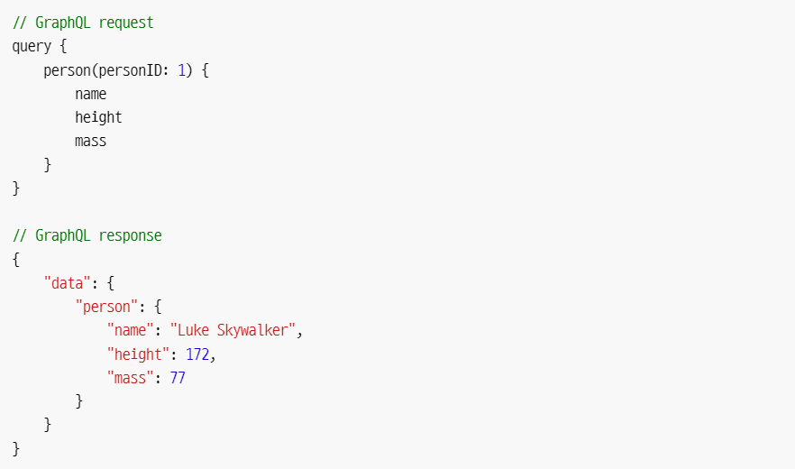
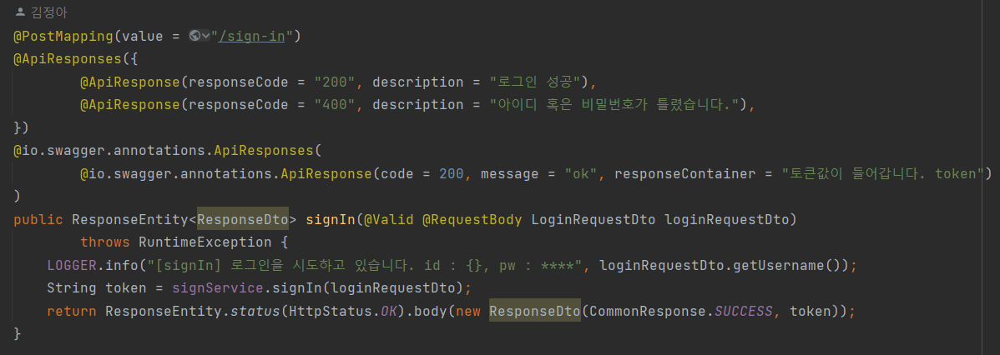
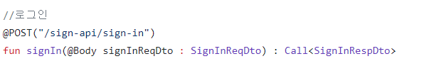
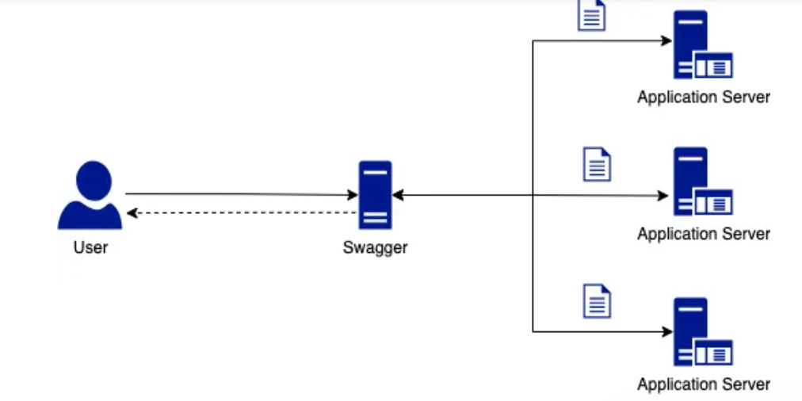
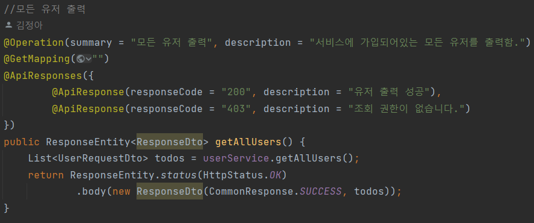
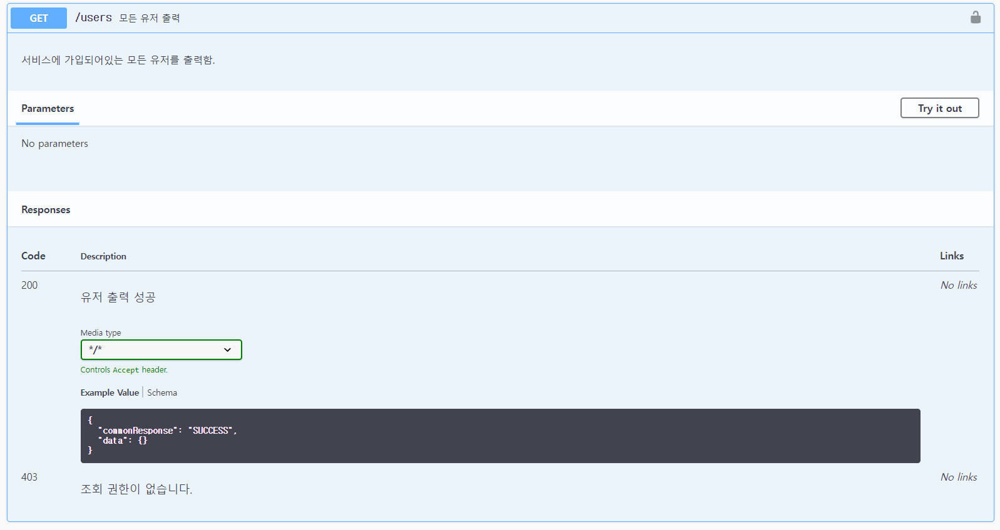

# 3주차 어쩌고저쩌고…

---

---

# API는 무엇이고 왜 사용할까요? 또, API를 문서화하는 방법은 무엇이 있을까요?

## 1. API란 무엇일까요?



> 애플리케이션을 서로 연결하여(통신할 수 있도록) 하여 그 애플리케이션을 사용 할 줄 몰라도 기능을 사용할 수 있도록 해주는 기술
> 

### **API(Application Programming Interface, 응용 프로그램 프로그래밍 인터페이스):**

응용 프로그램에서 사용할 수 있도록 운영 체제나 프로그래밍 언어가 제공하는 기능을 제어할 수 있게 만든 인터페이스.

어떤 기능을 만든 개발자가, 혹은 어떤 빅데이터를 가지고있는 기관이 기능을 API문서화하여 대중들에게 오픈해주면 이 API의 기능을 어떻게 구현하는지 몰라도 그 기능을 사용할 수 있게 해 준다.

권한 측면에서의 분류:

- 프라이빗:
    
    API를 내부에서만 사용할 수 있도록 하며, 기업이 API를 최대한으로 제어할 수 있다.
    
- 파트너:
    
    API를 특정 비즈니스 파트너와 공유하며, 품질 저하 없이 추가 수익원을 창출할 수 있다.
    
- 퍼블릭:
    
    API가 모두에게 제공된다.
    

기술 측면에서의 분류:

- 웹 API: 요청 메세지에 HTTP를 사용하여 응답 메시지 구조의 정의를 제공한다. 응답 형식은 XML 혹은 JSON으로 받을 수 있다.
    
    →
    
    - SOAP(Simple Object Access):
        
        SOAP로 설계된 API는 XML 메시지 형식을 사용하며 HTTP 또는 SMTP를 통해 요청을 수신한다. 간편한 방법으로 애플리케이션을 다양한 환경에서 실행하거나 다양한 언어로 작성하여 정보를 공유할 수 있다.
        
    - REST(Representational State Transfer):
        
        REST 아키텍처의 제약 조건을 준수하는 웹 API
        
- GraphQL:
    
    GraphQL 은 페이스북에서 만든 API를 위한 쿼리 언어(Query Language)이다.
    
    - GraphQL은 보통 **하나의 엔드포인트**를 가진다.
        
        
        
        REST API의 경우 반에 속해있는 데이터를 가져오는데에 응답마다 다양한 엔드포인트를 가진다.
        
        하지만 GraphQL은 하나의 엔드포인트 (Root Endpoint)에 다른 쿼리로 요청함으로써 다른 응답을 받을 수 있다.
        
    - GraphQL은 **요청할 때 사용하는 쿼리에 따라 다른 응답**을 받을 수 있다.
        - REST API
            
            
            
        - GraphQL
            
            
            
            →GraphQL은 **원하는 데이터(response)만 받을 수 있다**.
            
    - **고정된 요청과 응답만 필요할 때에는 query로 인해 요청의 크기가 Restful보다 커질 수 있다**.
    - **캐싱이 REST보다 복잡**하다.
    - 파일 업로드 구현 방법이 정해져있지 않아 직접 구현해야 한다.
    

👉장점:

- 이미 나와있는 기능을 사용하는것이기 때문에 개발 기간이 줄어든다.
- 쉽게 구할 수 없는 대용량 데이터를 사용할 수 있게 된다.
- API 제공자의 경우, 리소스에 대한 액세스 권한을 제공하면서 보안과 제어를 유지할 수 있다.

👉단점:

- 유료일 수 있다(혹은 호출 제한이 있을 수 있다.)
- API를 공개함으로써 예기치 않은 일이 일어날 수 있다.

👉사용예시:

프론트엔드 개발자와 협업하여 안드로이드 앱을 만들고자 할 때

서버 주소가 [http://ec2-3-36-184-17.ap-northeast-2.compute.amazonaws.com:8080](http://ec2-3-36-184-17.ap-northeast-2.compute.amazonaws.com:8080/swagger-ui/index.html#/)고,

클라이언트에게 제공하고 싶은 기능이 로그인 기능이라면



프론트엔드 개발자는 module 폴더의 NetworkModule.kt 폴더에서 서버 주소를 base URL로 설정한다.


그리고 불러와야하는 api를 프론트에서 호출해간다.



## 2. API 명세서(문서)란 무엇일까요?

> 소프트웨어의 상호작용 방법을 정의하는 역할을 하며, 외부 개발자 협업, 내부 개발 프로세스 개선, 그리고 소프트웨어 테스팅 및 디버깅에 필요한 중추적인 도구이다.
> 

API 명세서:

API가 어떻게 동작하는지에 대한 자세한 설명서이다.  개발자가 API를 쉽고 효과적으로 사용할 수 있게 해주는 핵심 도구이다.

API의 URL, 요청/응답 데이터 형식, 메소드(HTTP 메소드, 예: GET, POST), 헤더, 에러코드, 상태코드 등의 정보가 포함된다.

표준화된 API 명세서의 중요성:

- 개발자 간의 협업을 촉진한다.
- 외부 개발자가 소프트웨어를 쉽게 이해하고 활용할 수 있다.
- 시스템의 에러를 빠르게 찾고 해결하는데에 도움이 된다.

좋은 API 명세서를 위한 고려사항:

> 완전하게! 명확하게! 간결하게!
> 
- 정확성: API의 작동 방식을 정확하게 기술해야 한다. API가 어떤 입력을 받고, 어떤 출력을 내는지, 그리고 가능한 에러 상황과 대응 방안을 포함해야 한다.
- 세부 설명: API의 각 기능과 요청별 응답 예시를 포함해야 한다. 개발자가 예상하는 API의 동작 방식과 실제 동작 방식이 다르다면, 에러를 초래할 수 있다.
- 일관성: API 명세서는 전체적으로 일관성을 유지해야 한다. 동일한 정보나 구조를 여러 방식으로 표현하면, 혼동될 수 있다.

| INDEX | HTTP METHOD | URI(end point) | Description | Request Parameters | Response Parameters | HTTP Status |  |
| --- | --- | --- | --- | --- | --- | --- | --- |
| 1 | GET | /users | 유저 전체 표기 | 없음 | 유저아이디, 유저 이름, 유저 이메일 리스트

ex)
user1 이름 example@naver.com | 200: 유저 리스트 불러오기 성공
403: 조회 권한이 없습니다. |  |
| 2 | GET | /users/{user_id} | 유저 검색 | user_id:
검색하고싶은 유저의 아이디 | 검색한 아이디가 포함된 유저 리스트 | 200: 유저 검색 성공
404: 동일한 유저가 없습니다. |  |

## 3. API를 명세하기 위해 어떤 도구를 사용할 수 있나요???????????

API 명세 도구가 나오기 전에는 프론트엔드 개발자와 백엔드 개발자의 소통 방식은 

1. 백엔드 개발자가 문서로 URL, Request, Response를 적어서 API 설명서를 만든다.
2. 프론트엔드가 그걸 받아서 Postman이나 cURL로 테스트한다.
3. 프론트엔드에서 파싱한다.
4. 오류사항이나 수정사항을 다시 수기로 수정한다.

문제점:

- API 문서를 일일히 작성해야 해서 생산성이 떨어진다.
- 문서의 일관성이 떨어진다.
- API가 변경되면 문서를 다시 수정해야 한다.
- API 테스트가 힘들다.
- 의사소통 능력이 많이 필요해진다.

### Swagger(Open Api)

> Controller를 바탕으로 API 문서를 자동으로 작성해주고, 쉽게 테스트 할 수 있게 해주는 문서!
> 

Swagger 는 애플리케이션의 RESTful API 문서를 자동으로 구성하는 특수 도구이다.

특징:

- API 문서를 생성할 때, 개발자가 문서를 작성하지 않아도 되므로 개발 시간을 단축할 수 있게 된다.
- 스웨거를 통해 직접 실행시켜보거나, 값을 넣어볼 수 있기 때문에 API를 쉽게 테스트 가능하다.
- API 호출 시 전달해야 할 파라미터를 쉽게 볼 수 있다.
    
    →개발자가 개발에만 집중 할 수 있게 해준다.
    

Swagger를 구성하는 방법:

- YAML 파일을 사용하여 구성하기
    
    
    
    스웨거를 위한 서버를 따로 두는 방법이다.
    
    ```jsx
    //openapi 버전 명시
    openapi: 3.0.0
    //API 문서의 제목, 버전, 설명, 저자 및 라이선스 정보 작성
    info:
    	title: my app
    	version: 1.0.0
    //API 서버들의 URL과 설명 나열
    servers:
    	url: https://어쩌고저쩌고.com/api/vi
    	description: Server A
    	variables:
    		env:
    			default: production
    			enum:
    				- production
    				-staging
    	-url: <https://api.example-2.com>
    	 discription: Server B
    //경로별로 API 엔드포인트 관련 정보를 기술하고, 각 경로에서 사용 가능한 HTTP 메서드를 명시하고,
    //응답 매개변수를 정의한다.
    paths:
    	/users:
    		get
    			summary: Get all users
    			responses:
    				200:
    					discription:
    					content:
    						application/json...
    //스키마, 응답, 매객변수, 예제, 요청본문 등의 재사용 가능한 API 구성 요소를 정의한다.
    components:
    	schemas:
    		User:
    			type: object
    			properties:
    				id:
    					type: integer
    				name:
    					type:string...
    ```
    

이 방법은 개발할때보다는 별도로 배포하고자 할 때 적합하다.

- 소스코드 내에서 Swagger를 설정해서 구성하기.
    
    스프링부트 내에서 구현하는 방법이다. 버전별로 구현 방법이 살짝씩 다르다.
    
    ```jsx
    //의존성 주입
    dependencies{
    	implementation('io.springfox:springfox-boot-starter:3.0.0')
    }
    ```
    
    ```jsx
    //설정 파일
    @Configuration
    public class SwaggerConfig {
    
        @Bean
        public Docket api(){
            return new Docket(DocumentationType.OAS_30)
                    .useDefaultResponseMessages(false)// 기본 응답 메시지 사용 안 함
                    .select()
                    .apis(RequestHandlerSelectors.basePackage("com.example.demo.controller"))// com.example.demo.controller 패키지의 API만 스캔
                    .paths(PathSelectors.any()) // /api로 시작하는 경로만 스캔
                    .build()
                    .apiInfo(apiInfo()) //API 정보 설정
                    .securityContexts(Arrays.asList(securityContext()))//보안 관련
                    .securitySchemes(Arrays.asList(apiKey()));
        }
    
        private ApiInfo apiInfo(){
            return new ApiInfoBuilder()
                    .title("Todolist 스웨거")
                    .description("Todolist 기능을 실험할 수 있는 스웨거.<br> "
                            )
                    .version("3.0")
                    .build();
    
        }
    ```
    
    -컨트롤러
    
    
    
    -스웨거
    
    
    

이 외에도 RAML, API Blueprint 등의 도구 있다.