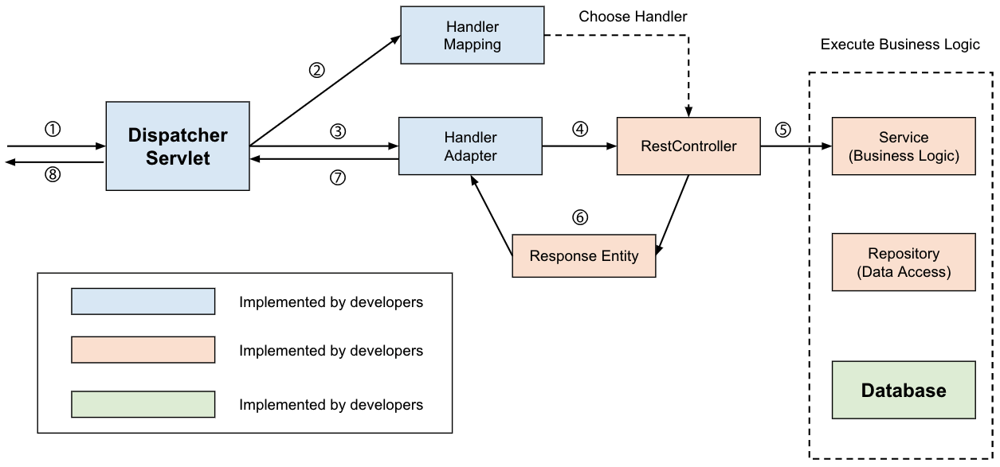
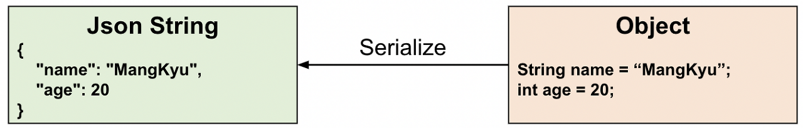
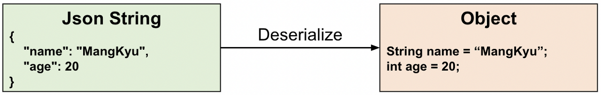
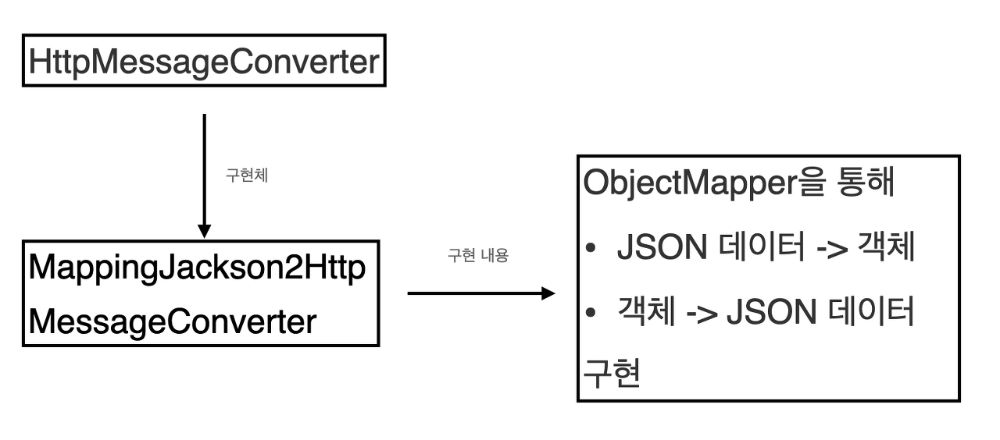

# Controller의 메소드 내 아무런 어노테이션이 없을때 스프링은 이 값들을 어떻게 처리하나요?


```java
@RestController
public class testController {

    ...생략
    
   
    public testMethod() throws IOException {
        ...생략
    }

```
위 코드와 같이 controller클래스 안에 메소드에 어노테이션이 붙어있지 않다면 어떻게 될까?


스프링 MVC는 위 그림과 같이 request가 들어오면 Dispatcher Servlet이 Handler Mapping을 통해 해당 request를 처리해줄 적절한 메소드를 찾아 처리를 위임합니다. 그러나 @RequestMapping이나 @PostMapping과 같은 어노테이션이 없으면 request를 처리해줄 컨트롤러의 메소드를 찾을 때 해당 메소드가 검색이 되지않아 메소드에 요청 처리가 할당되지 않습니다. 

Application.run()메소드가 실행될 때 ApplicationContext가 생성이 됩니다. 그 뒤 ApplicationContext가 refresh 단계를 거치면 모든 객체들이 싱글톤으로 인스턴스화되는데 이 단계에서 @RequestMapping이 붙은 메소드가 handler로 등록이 되어집니다. 그러나 컨트롤러에 이러한 @RequestMapping과 같은 매핑어노테이션이 없다면 핸들러로 등록이 되지않아 아무 요청도 할당받지 못하는 메소드가 되어버립니다.

# 직렬화, 역직렬화란?

직렬화 : 객체들의 데이터를 연속적인 데이터(스트림)로 변형하여 전송 가능한 형태로 만드는 것

역직렬화 : 직렬화된 데이터를 다시 객체의 형태로 만드는 것



자바의 입출력처리는 기본형 데이터 처리만 지원을 합니다. 따라서 네트워크로 데이터를 전송할 때 참조형 데이터는 전달할 수 없습니다.

- 기본형 데이터 : int,float,char 등.. / 스택영역에 저장
- 참조형 데이터 : 자바 클래스의 인스턴스와 멤버변수, 배열 등.. / 힙영역에 저장

기본형 데이터는 변수에 값을 저장하지만 배열이나 문자열,클래스와 같은 참조타입은 값이 아닌 주소값을 저장합니다. 그러나 객체를 네트워크를 통해 전송할 때 각 pc마다 메모리공간은 다르기 때문에 원하는 데이터를 전송할 수 없습니다. 따라서 직렬화를 통해 해당 주소에 있는 값을 가져와 연속적인 데이터로 변형하는 직렬화 과정을 거쳐야 합니다.

# 직렬화 과정

```java
@PostMapping("/boards")
    public ResponseEntity<Object> saveMember(@RequestBody ADTO aDTO) {
        ...생략
       return ResponseEntity.ok().body(bDTO);
    }
```
- 위 코드에서 return ResponseEntity.ok().body(bDTO);를 반환하여 응답을 클라이언트로 전송하기 위해서는 bDTO객체를 네트워크를 통해 전송가능한 포멧으로 변환하는 직렬화 과정을 거쳐야 합니다. 

- 이 과정에서 HttpMessageConverter인터페이스를 구현한 구현체 중 하나인 MappingJackson2HttpMessageConverter 클래스에서 ObjectMapper를 사용하여 java객체를 Json 데이터로 변환합니다.

-  ObjectMapper는 리플렉션을 이용하여 객체를 Json으로 바인딩하게 됩니다. 

# 역직렬화 과정

- 위와 코드와 같이 @RequestBody를 사용한 경우 클라이언트에서 서버로 request가 전달되면 HttpRequest Message의 body에 데이터들이 json형태로 전달되어집니다.

- 그러면 body를 통해 전달된 json데이터들을 객체로 변환하는 역직렬화가 진행됩니다. 

- 이 과정에서 직렬화 과정과 마찬가지로 HttpMessageCoverter인터페이스를 구현한 구현체에서 ObjectMapper를 사용하여 역직렬화를 진행합니다. ObjectMapper는 리플렉션을 이용하여 json문자열을 객체로 바인딩하게 됩니다.

# ObjectMapper 동작 원리

직렬화와 @RequestBody를 이용한 역직렬화의 경우 모두 HttpMessageCoverter구현체중 Json데이터를 처리해 줄 MappingJackson2HttpMessageConverter클래스에서 ObjectMapper를 사용하게 됩니다. 여기서 ObjectMapper는 직렬화/역직렬화를 할 때 매핑할 필드를 getter/setter메소드를 통해 찾습니다. 즉, 게터메소드 명에서 get을 제외한 뒤 앞글자를 소문자로 변환한 필드값을 사용하여 매핑할 필드를 찾습니다. 따라서 getter/setter메소드의 메소드명을 관례와 다르게 작성한 경우 직렬화/역직렬화가 올바르게 작동하지 않을 수 있습니다.

또한 이러한 이유로 getter와 setter중 하나만 있어도 매핑해야할 필드를 찾기가 가능합니다. 

직렬화와 역직렬화를 진행할 때 기본생성자 또한 있어야 합니다. 그 이유는 직렬화/역직렬화 과정에서 기본생성자를 사용하여 객체의 인스턴스를 생성하기 때문입니다. 이렇게 객체의 인스턴스를 생성한 뒤에 필드값을 바인딩 하게 되는데 이때 setter메소드가 없어도 정상적으로 json데이터가 객체로 바인딩 되는데 그 이유는 객체를 바인딩 할 때 setter를 사용하는것이 아닌 리플렉션을 사용하여 바인딩하기 때문입니다.

- @ResponseBody, @RequestBody를 사용할 경우 객체의 직렬화/역직렬화 과정이 필요하며 이 경우 HttpMessageCoverter구현체에서 ObjectMapper를 사용하여 객체를 바인딩 한다.
- json데이터를 객체로 바인딩하기 위해서는 객체의 인스턴스를 생성해야 하기 때문에 기본생성자가 필요하다.
- 객체의 필드와 json데이터를 매핑하기 위해서는 getter와 setter메소드의 메소드명을 사용하여 매핑하며 바인딩할 때 리플렉션을 이용하기 때문에 setter메소드가 없어도 된다.



# @ResponseBody vs @ModelAttribute

위 두 어노테이션 모두 요청받은 값을 자바 객체로 매핑하는 어노테이션입니다. 그러나 이 두 어노테이션은 여러 차이점이 있습니다.

우선 @ResponseBody는 서버에 요청을 보낼 때 요청 바디에 Json이나 XML과 같은 포멧으로 데이터를 전송할 때 해당 데이터들을 객체로 역직렬화할 때 사용하는 어노테이션입니다.
그러나 @ModelAttribute는 ?name=req&age=1 같은 Query String 형태 혹은 요청 바디에 삽입되는 Form 형태의 데이터를 자바 객체로 역직렬화할 때 사용하는 어노테이션입니다. 

또한 @ResponseBody는 ObjectMapper를 사용하여 역직렬화를 하지만 @ModelAttribute는 ModelAttributeMethodProcessor클래스를 사용하여 역직렬화를 한다는 차이가 있습니다. 따라서 @ModelAttribute는 다음과 같은 과정을 통해 역직렬화를 진행하게 됩니다.

1. ModelAttributeMethodProcessor클래스의 supportsParameter() 메소드를 통해 바인딩이 가능한지 판단한다.
2. createAttribute()메소드를 통해 바인딩할 객체를 생성합니다. 생성자가 하나일 경우 해당 생성자를 통해 객체를 생성하고 생성자가 여러개일 경우 파라미터가 가장 많은 생성자를 선택해 객체를 생성한다. 생성자를 호출하여 객체를 생성할 떄 리플렉션을 사용
3. 바인딩되지 않은 필드에 대해서는 setter메소드를 통해 바인딩한다.

따라서 @ModelAttribute를 사용할 경우 setter메소드나 필드를 파라미터로 가지는 생성자가 필요합니다. 또한 생성자의 파라미터와 필드명은 동일해야만 바인딩이 정상적으로 진행이 되며 생성자에 포함되지 않고 setter메소드가 없는 필드의 경우 바인딩이 되지않습니다. 만약 모든 필드를 포함하는 생성자를 가지고 있는 경우 setter메소드가 필요없습니다.

