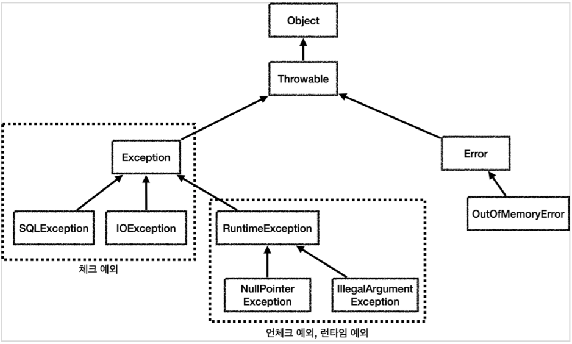

# 오류

프로그램을 실행하다 보면 어떠한 원인때문에 비정상적인 동작이 발생하여 프로그램이 종료되는 상황을 자주 볼 수 있는데 이를 오류가 발생했다라고 말한다. 


- 컴파일 오류 : .class파일을 컴파일하는 과정에서 JVM이 던지는 오류로 대부분 문법적 오류에 의해 발생하는 경우가 대부분이다. EX) ClassNotFoundException,IllegalAccessException
- 런타임 오류 : 런타임 오류는 문법적인 오류는 없으나 컴파일이 된 후 프로그램이 실행되는 과정에서 발생하는 오류를 말한다. EX) NullPointerException, ArithmeticExcception, IndexOutOfBoundsException
  

# 에러와 예외의 차이

예외(Exception)

- 예외는 개발자가 구현한 로직에서 발생한 실수나 사용자의 실수에 의해 발생하며 런타임 시점에 발생한다. 
- 개발자가 미리 예측하여 방지가 가능하기때문에 상황에 맞는 예외처리(Exception Handle)을 해줘야한다.
- 예외를 적절히 처리하지 않으면 프로그램이 비정상적으로 종료될 수 있다.
- Checked/UnChecked Exception으로 분류
- SQLException, IOException, NullPointerException, ClassNotFoundException, NumberFormatException, IndexOutOfBoundsException 등등...
```java
// NullPointerException 
String str = null;
System.out.println(str.length()); 

// NumberFomatException 
int num = Integer.parseInt("exception");

// IndexOutOfBoundsException 
int[] arr = {1, 2, 3};
System.out.println(arr[5]); 

// ClassNotFoundException 
Class.forName("com.example.MyClass");

// IllegalAccessException
class MyClass {
    private int test = 10;
}
int test1 = myClass.test;

// ArithmeticException
int test = 10/0;

```


에러(Error) 

- 시스템에 비정상적인 상황이 발생했을 때 발생하며 개발자가 예측하기 어려우며 처리가 불가능하다.
- 에러는 대부분 시스템이나 하드웨어의 문제로 발생하며 
- StackOverflowError, OutOfMemoryError, AbstractMethodError등등...
```java
// AbstractMethodError
public interface MyInterface {
    void myMethod();
}
AbstractMethodErrorExample example = new AbstractMethodErrorExample();
example.myMethod();

// OutOfMemoryError
List<byte[]> list = new ArrayList<>();
while (true) {
    list.add(new byte[1024 * 1024]); 
}

// StackOverflowError
void recursiveMethod() {
    recursiveMethod();
}
```


# Checked/UnChecked Exception

예외는 Checked Exception과 UnChecked Exception으로 나눌 수 있다. 

Checked Exception 
- 컴파일시점에 잡히는 예외를 의미하며 무조건 try-catch나 throws로 예외를 처리하라고 강제한다. 
- 예외 발생 시 트랜잭션 롤백을 하지 않으며 RuntimeException을 상속하지 않는 예외가 이에 해당한다. ex) IOException, ClassNotFoundException, SQLException

Unchecked Exception 
- 컴파일 시점에 예외가 잡히지 않고 런타임때 잡히는 예외로 예외 발생시 트랜잭션 롤백이 진행되어야 한다. 
- 언체크 예외는 예외처리를 하지 않아도 프로그램이 정상적으로 돌아간다. 그러나  언체크 예외가 발생했을 때 해당 예외에 대해 예외처리 로직을 작성하지 않았다면 프로그램이 비정상 종료된다. ex) RuntimeException의 하위 클래스

# 예외처리방법

결국 Checked/Unchecked Exception 모두 예외처리를 해 주는것이 좋은데 예외처리방법에는 예외복구, 예외회피, 예외전환이 있다.

예외복구
- 예외복구는 예외상황을 파악하고 문제를 해결하여 정상상태로 돌려놓도록 시도하는 예외처리방법이다.
- 예외를 catch한 뒤 일정시간이나 횟수만큼 재시도하여 정상적으로 로직이 수행되도록 하는 예외처리방법
- 최대 시도횟수가 초과하면 다른 예외를 throw하거나 다른 비즈니스로직을 실행시켜 애플리케이션 흐름을 정상적으로 마무리하게 유도할 수 있다.
- ex) 접속이 불안정한 경우 일정횟수나 시간만큼 재접속을 시도한다.

```java
while (재시도 횟수) {

    try {
        // 비즈니스 로직
    }
    catch (Exception e) {
        // 에러 로깅 or 일정시간 대기
    }
}

// 다른 비즈니스로직 실행 or 예외 throw

```

예외회피
- 예외회피는 예외를 직접처리하지 않고 예외가 발생한 메서드를 호출한 메서드에게 예외처리를 위임하는 것이다.
- 추천되는 방법은 아니며 호출한 쪽에서 예외를 처리하는 것이 바람직할 때 사용한다. 
  
```java
try {
        // ... 생략
} catch(SQLException e) {
        throw e;
}

```

예외전환
- 예외전환은 throw를 통해 더 적절한 예외로 전환하여 호출한 메소드에게 예외처리를 위임하는 것이다.
- 어떤 Exception이 발생했는지 확인하기 쉽게 customException을 만들어 해당 예외처리를 수월하게 하기위해 자주 사용되는 방식이다.
  
```java
try {
	// 비즈니스 로직
}
catch(Exception e) {
    throw CustomException("test");
}
```

# 예외처리 주의사항

1. catch에는 로깅, 복구 등의 로직을 추가하기
- 예외를 아무 로직 없이 catch만 하는 것은 바람직 하지 않다.
- catch에 단순히 throw만 하는 것도 바람직 하지 않다.
- 로그를 출력하거나, 문제를 원상 복구 시키는 로직을 첨가하는 등 catch만 수행하지 않고 해당 예외에 대한 처리를 해주어야 한다.

2. 예외 Stack을 남겨 추적, 유지보수성 높이기
- Exception의 추적성과 유지보수 성을 높이기 위해서, e.toString() 이나 e.getMessage()로 마지막 예외 메세지만 남기기보다, 전체 Exception Stack을 다 넘기는 편이 좋다.
- 대표적인 slf4j 라이브러리의 log.error() 역시 e.printStackTrace()처럼 Exception의 stack도 남긴다.


