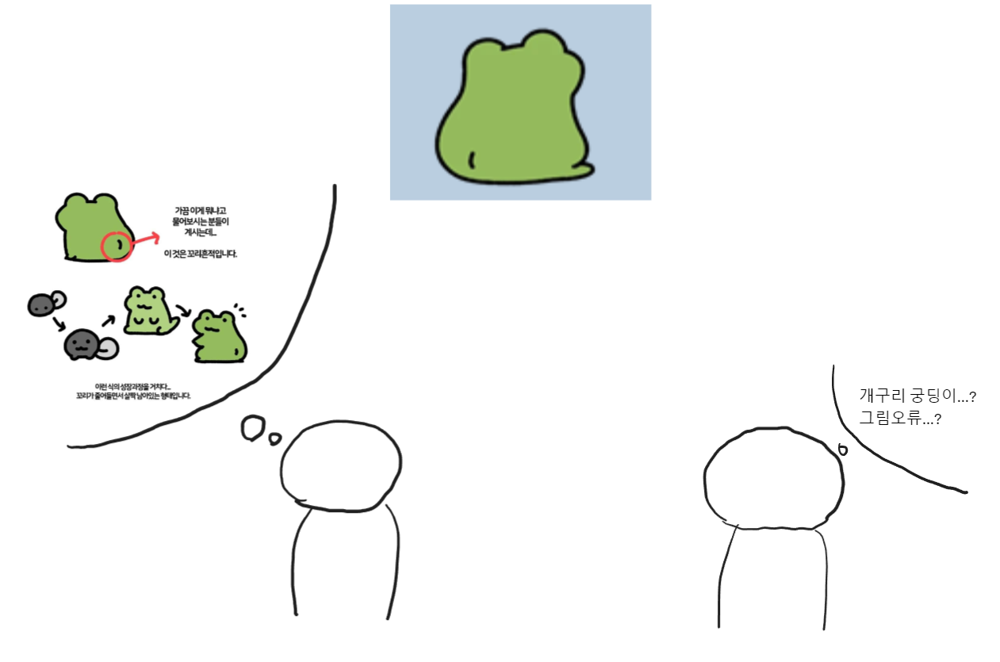
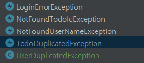
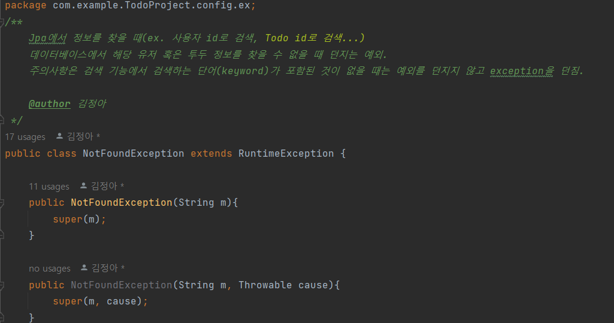

# 스프링 커스텀 예외처리

# 커스텀 예외를 사용하는 이유?

## 커스텀 예외 vs 표준 예외

- 표준 예외를 권장하는 이유
    - 예외 메시지로도 충분히 의미를 전달할 수 있다.
        
        예를 들어 커스텀 예외를 하나 생성한다고 해 보자
        
        ```jsx
        public class UserNameEmptyException extends RuntimeException{
        
        	public UserNameCmptyException(String message){
        }
        }
        ```
        
        이름만 봐도 이 예외가 무슨 예외인지 알 수 있지만 이것 하나를 위해서 커스텀 예외를 만드는 것은 투머치하다.
        
        유효하지 않은 입력에 대한 예외이므로 표준 예외인 IllegalArgumentException을 사용하면 충분히 의미가 전달되면서 리소스를 아낄 수 있다.
        
    - 표준 예외를 사용하면 가독성이 높아진다.
        
        IlleagelArgumentException: 인수로 부적절한 값이 들어올 때 던지는 예외
        
        IllegalStateException: 적합하지 않은 객체인 경우 던지는 예외
        
        UnsupportedOperationException: 요청받은 작업을 지원하지 않는 경우 던지는 예외
        
        ex)
        
        
        
        커스텀 예외가 직관적인 네이밍이긴 하지만 이미 알고 있는 표준적인 예외에 비해선 파악이 느려질 수 밖에 없다. 
        
    - 일일히 예외 클래스를 만들다보면 지나치게 커스텀 예외가 많아질 수 있다.
        
        
        
        프로젝트를 만들 땐 다양한 상황이 있고, 그 상황에 맞게 네이밍을 해서 수많은 예외 클래스를 만들다보면 굉장히 많아지게 된다. 예외가 너무 많이 만들어지다 보면 이걸 관리하는것도 일이고, 예외가 차지하는 리소스가 많아지게 되어 성능 저하가 우려된다.
        
        이미 자바에서 충분히 많은 표준 예외를 제공하고 있으므로 이걸 사용하는게 리소스 절약이 된다.
        
- 커스텀 예외
    - 이미 유명한 곳에서도 Custom Exception을 쓴다(!)
        
        우리가 @Valid 어노테이션에서 발생하는 예외를 잡을때 쓰는 MethodArgumentNotValidException은 놀랍게도 자바 표준 예외가 아니라 Spring에서 만든 사용자 정의 예외다. 
        
    - 이름만으로도 정보 전달이 가능하다
        
        NoSuchElementException이라는 예외가 있다. 요소가 없음을 나타내는 자바 표준 예외인데
        
        이것만 가지고는 무슨 요소가 없어서 예외가 터졌는지 알 수 없다.
        
        만약 Custom exception의 이름을 Post+Not+Found+Exception으로 짓는다면 Post 요청을 보냈지만 해당 요소가 없다는 상황을 유추 가능해진다.
        
        → Custom exception은 이름을 통해 일차적으로 예외 발생 상황에 대해 유추할 수 있게 된다.
        
    - 상세한 예외 정보를 제공할 수 있다.
        
        컬렉션의 범위를 벗어난 index 접근 요청이 생겼다고 했을 때
        
        -표준 예외를 쓸 경우
        
        ```java
        if (index >= arr.length) {
          throw new IndexOutOfBoundsException("범위를 벗어났습니다.");
        }
        ```
        
        -커스텀 예외를 쓸 경우
        
        ```java
        public class IllegalIndexException extends IndexOutOfBoundsException {
        	private static final String message = "범위를 벗어났습니다.";
        
        	public IllegalIndexException(List<?> target, int index) {
        		super(message + " size: "  + target.size() + " index: " + index);
        	}
        }
        ```
        
        이렇게 하면 요청 받은 컬렉션의 최대 범위가 어디까지인지, 요청한 index가 몇이였는지에 대해 바로 알 수 있게 되기 때문에 개발이 편해질것이다.
        
        만약 클라이언트가 다른 정보를 요구한다던지 등 요청하는 정보가 달라져야 한다면 위의 클래스에서 원하는 데이터로 바꾸기만 하면 된다.
        
    - 예외에 대한 응집도가 향상된다.
        
        ```jsx
        package com.example.TodoProject.config;
        
        import com.example.TodoProject.common.CommonResponse;
        import com.example.TodoProject.config.ex.DuplicatedException;
        import com.example.TodoProject.config.ex.NotFoundException;
        import com.example.TodoProject.dto.CommonResponseDto;
        import lombok.extern.slf4j.Slf4j;
        import org.springframework.http.HttpHeaders;
        import org.springframework.http.HttpStatus;
        import org.springframework.http.ResponseEntity;
        import org.springframework.validation.BindingResult;
        import org.springframework.validation.FieldError;
        import org.springframework.web.bind.MethodArgumentNotValidException;
        import org.springframework.web.bind.annotation.ExceptionHandler;
        import org.springframework.web.bind.annotation.RestControllerAdvice;
        import org.springframework.web.context.request.WebRequest;
        import org.springframework.web.servlet.mvc.method.annotation.ResponseEntityExceptionHandler;
        
        import java.util.HashMap;
        import java.util.List;
        import java.util.Map;
        import java.util.stream.Collectors;
        
        @Slf4j
        @RestControllerAdvice
        public class GlobalExceptionHandler extends ResponseEntityExceptionHandler {
        
            @ExceptionHandler(value = DuplicatedException.class)
            public ResponseEntity<CommonResponseDto> handleDuplicatedException(DuplicatedException duplicatedException) {
                log.error(duplicatedException.getMessage());
                return ResponseEntity.status(HttpStatus.NOT_FOUND).body(new CommonResponseDto(CommonResponse.FAIL, duplicatedException.getMessage(), "null"));
            }
        
            @ExceptionHandler(value = NotFoundException.class)
            public ResponseEntity<CommonResponseDto> handleNotFoundException(NotFoundException notFoundException) {
                log.error(notFoundException.getMessage());
                return ResponseEntity.status(HttpStatus.NOT_FOUND).body(new CommonResponseDto(CommonResponse.FAIL, notFoundException.getMessage(), "null"));
            }
        
            @Override
            protected ResponseEntity<Object> handleMethodArgumentNotValid(MethodArgumentNotValidException ex, HttpHeaders headers, HttpStatus status, WebRequest request) {
                List<String> errors = ex.getBindingResult().getAllErrors().stream()
                        .filter(error -> error instanceof FieldError)
                        .map(error -> ((FieldError) error).getDefaultMessage())
                        .collect(Collectors.toList());
        
                return ResponseEntity.status(HttpStatus.BAD_REQUEST).body(new CommonResponseDto(CommonResponse.FAIL, "유효성 검사 실패", "null"));
            }
        }
        ```
        
        표준 예외와 메시지로도 충분히 정보를 전달 가능하지만, 전달하는 정보의 양이 많아질수록 예외 코드가 더러워진다.
        
        따로 함수로 분리해도 서로 다른 클래스에서 같은 예외가 발생한다면 책임 소재가 불분명해진다.
        
        사용자 정의 예외를 사용한다면 메소드를 한 곳에서 관리 가능하기 때문에 객체의 책임이 분리되어 깔끔한 코드가 된다.
        
    - 예외 발생 후처리가 용이하다.
        
        ```java
        // in SomeController.java
        @Controller
        public class SomeController {
            // ...
            @PostMapping("/some")
            public ResponseEntity<Void> Some(@RequestBody SomeRequest request) {
                Something something = someService.someMethod(request);
                if (somevalidate(something)) {
                    throw new IllegalArgumentException();
                }
        
                SomeExternalLibrary.doSomething(something);
        
                return ResponseEntity.ok().build();
            }
            // ...
        }
        ```
        
        이런 코드가 있다고 가정했을때, 표준 예외를 쓰면 이게 some() 안에서 발생한건지, 라이브러리에서 발생한건지 알아채기 힘들다.
        
        Advice에서 일괄처리를 하고 싶어도 발생 장소에 따라 처리 방법이 달라질 수 있다.
        
        custom Exception에서는 모든 사용자 정의 예외가 상속받는 예외를 만들고,
        
        Advice에서 이 예외를 처리하는 메소드를 만들어서 예외 처리 코드를 간소화 가능하다.
        
        그리고 예측 가능한 상황에서 의도적으로 발생시킨 예외인지, 아직 잡지 못한 예외인지 구분 가능해진다.
        
    - 예외 생성 비용을 절감한다.
        
        stack trace 부분을 생략하여 생략하거나 줄여서 비용 절감이 가능하다
        

# 커스텀 예외를 활용한 예외 처리 - 상속받아야 할 Exception class는?

커스텀 예외를 큰 과정으로 보자면

1. 컨트롤러에서 발생하는 예외를 전역적으로 받아주는 GlobalExceptionHandler 생성
    
    ```jsx
    @Slf4j
    @RestControllerAdvice
    public class GlobalExceptionHandler extends ResponseEntityExceptionHandler {
    
    }
    ```
    
    @Slf4j는 로그를 생성하기위해 쓰는 어노테이션이다.
    
    @ControllerAdvice, @RestControllerAdvice 
    
    - 전역적으로 예외를 처리할 수 있는 어노테이션이다.
    - @RestController, Controller 어노테이션이 붙은 컨트롤러에서 발생하는 예외를 처리 가능하다.
    - @ControllerAdvice, @RestControllerAdvice는 컨트롤러에 대해 @ExceptionHandler, @InitBinder, @ModelAttribute가 적용된 메소드에 AOP를 적용하기 위해 고안되었다.
        
        
        - @InittBinder, @ModelAttribute 설명
            
            @InitBinder는 @(Rest)Controller 가 적용된 Bean에서 바인딩 또는 검증 설정을 변경하고 싶을때 사용된다.
            
            만약 그 바인딩 설정을 모든 Controller에 대해 전역적으로 사용하고싶다면 @InitBinder를 @ControllerAdvice가 붙은 빈에서 사용하면 된다.
            
            @ModelAttirbute는 @Controller 가 적용된 Bean에서 웹 뷰로 넘겨주는 데이터 폼인 model의 attribute를 설정해주도록 한다. @ModelAttribute는 메소드와 파라미터에 붙을 수 있다.
            
            만약 그 Model 설정을 모든 Controller에 대해 전역적으로 사용하고싶다면 @ModelAttribute @ControllerAdvice가 붙은 빈에서 사용하면 된다.
            
        
    - 또한, @Component가 포함되어 있기 때문에, **빈으로 관리된다.**
    
    extends ResponseEntityExceptionHandler
    
    - **`ResponseEntityExceptionHandler`**는 **`@ControllerAdvice`**를 확장한 클래스로, 주로 Spring MVC에서 제공하는 추상 클래스 중 하나이다.
    - 주로 RESTful API에서 사용되며, **`ResponseEntity`**를 반환하는 방식으로 예외 처리 결과를 전달한다.
    - handle메서드를 오버라이딩하여 특정 예외에 대한 처리 로직을 정의하며, **`ResponseEntity`**를 반환한다.
    - 주로 HTTP 응답 상태 코드, 응답 본문 등을 세밀하게 제어할 수 있다.
    
    *예외처리를 하는 과정
    
    1. 디스패처 서블릿이 에러를 잡는다.
        
        ```jsx
        protected void doDispatch(HttpServletRequest request, HttpServletResponse response) throws Exception {
            try {
                // 요청을 컨트롤러로 위임하는 부분 생략
            }
            catch (Exception ex) {
                dispatchException = ex;
            }
            catch (Throwable err) {
                dispatchException = new NestedServletException("Handler dispatch failed", err);
            }
                
            processDispatchResult(processedRequest, response, mappedHandler, mv, dispatchException);
        }
        
        ```
        
        exception이 null인지 아닌지 판단하여 존재하면 에러를 처리해준다.
        
        일반적으로 우리가 추가한 Exception들은 processHandlerException에서 처리된다.
        
        ```jsx
        private void processDispatchResult(HttpServletRequest request, HttpServletResponse response,
            @Nullable HandlerExecutionChain mappedHandler, @Nullable ModelAndView mv,
            @Nullable Exception exception) throws Exception {
        
            boolean errorView = false;
        
            if (exception != null) {
                if (exception instanceof ModelAndViewDefiningException) {
                    logger.debug("ModelAndViewDefiningException encountered", exception);
                    mv = ((ModelAndViewDefiningException) exception).getModelAndView();
                }
                else {
                    Object handler = (mappedHandler != null ? mappedHandler.getHandler() : null);
                    mv = processHandlerException(request, response, handler, exception);
                    errorView = (mv != null);
                }
            }
        
            // 생략
        }
        
        ```
        
    2. 해당 에러를 잡을 수 있는 HandlerExceptionResolver가 에러를 처리한다
        
        ```jsx
        @Override
        @Nullable
        public ModelAndView resolveException(
            HttpServletRequest request, HttpServletResponse response, @Nullable Object handler, Exception ex) {
        
            if (this.resolvers != null) {
                for (HandlerExceptionResolver handlerExceptionResolver : this.resolvers) {
                    ModelAndView mav = handlerExceptionResolver.resolveException(request, response, handler, ex);
                    if (mav != null) {
                        return mav;
                    }
                }
            }
            return null;
        }
        //ControllerAdvice는(handlerExceptionResolver의 구현체) 
        //ExceptionHandlerExceptionResolver에 의해 처리된다.
        ```
        
    3. 컨트롤러의 exceptionHandler로 잡을 수 있는지 검사한다.
        
        ```jsx
        @Nullable
        protected ServletInvocableHandlerMethod getExceptionHandlerMethod(
                @Nullable HandlerMethod handlerMethod, Exception exception) {
        
            Class<?> handlerType = null;
        
            if (handlerMethod != null) {
                handlerType = handlerMethod.getBeanType();
                ExceptionHandlerMethodResolver resolver = this.exceptionHandlerCache.get(handlerType);
                if (resolver == null) {
                    resolver = new ExceptionHandlerMethodResolver(handlerType);
                    this.exceptionHandlerCache.put(handlerType, resolver);
                }
                Method method = resolver.resolveMethod(exception);
                if (method != null) {
                    return new ServletInvocableHandlerMethod(handlerMethod.getBean(), method, this.applicationContext);
                }
                // For advice applicability check below (involving base packages, assignable types
                // and annotation presence), use target class instead of interface-based proxy.
                if (Proxy.isProxyClass(handlerType)) {
                    handlerType = AopUtils.getTargetClass(handlerMethod.getBean());
                }
            }
            
            ...
        }
        ```
        
    4. ControllerAdvice의 ExceptionHandler로 처리 가능한지 검사한다.
        
        ```jsx
        @Nullable
        protected ServletInvocableHandlerMethod getExceptionHandlerMethod(
                @Nullable HandlerMethod handlerMethod, Exception exception) {
        
            ...
        
            for (Map.Entry<ControllerAdviceBean, ExceptionHandlerMethodResolver> entry : this.exceptionHandlerAdviceCache.entrySet()) {
                ControllerAdviceBean advice = entry.getKey();
                if (advice.isApplicableToBeanType(handlerType)) {
                    ExceptionHandlerMethodResolver resolver = entry.getValue();
                    Method method = resolver.resolveMethod(exception);
                    if (method != null) {
                        return new ServletInvocableHandlerMethod(advice.resolveBean(), method, this.applicationContext);
                    }
                }
            }
        
            return null;
        }
        ```
        
    5. ControllerAdvice의 ExceptionHandler 메소드를 Invoke하여 예외를 반환한다.
        
        ```jsx
        @Nullable
        protected Object doInvoke(Object... args) throws Exception {
            Method method = getBridgedMethod();
            try {
                if (KotlinDetector.isSuspendingFunction(method)) {
                    return CoroutinesUtils.invokeSuspendingFunction(method, getBean(), args);
                }
                return method.invoke(getBean(), args);
            }
        
            ...
        }
        ```
        
2. custon Exception 생성
    
    ```jsx
    public class DuplicatedException extends RuntimeException {
        public DuplicatedException(String m) {
            super(m);
        }
    }
    ```
    
    **일반 예외**로 선언할 경우→ **Exception**을 상속받아 구현
    
    **실행 예외**로 선언할 경우→ **RuntimeException**을 상속받아 구현
    
    Exception과 RuntimeException의 차이는 컴파일러가 체크하느냐, 체크하지 않느냐의 차이다.
    
    여기서 m(message)은 직접 넣을수도 있고
    
    enum 구현을 통해 넣을수도 있다.
    
    ```jsx
    @Getter
    @AllArgsConstructor
    public enum ErrorCode {
    
        /* 400 BAD_REQUEST : 잘못된 요청 */
        USER_ID_NOT_THE_SAME(BAD_REQUEST, "로그인 정보[ID]가 올바르지 않습니다."),
        SOCIAL_LOGIN_ID_AND_AUTH_PROVIDER_NOT_THE_SAME(BAD_REQUEST, "로그인 정보[SOCIAL_LOGIN_ID, AUTH_PROVIDER]가 올바르지 않습니다."),
        REFRESH_TOKEN_NOT_FOUND(BAD_REQUEST, "쿠키에 리프레시 토큰이 존재하지 않습니다."),
    
     	 ...
    
        private final HttpStatus httpStatus;
        private final String detail;
    
    }
    ```
    
3. ExceptionHandler로 custom Exception을 잡는다.
    
    ```jsx
    @Slf4j
    @RestControllerAdvice
    public class GlobalExceptionHandler extends ResponseEntityExceptionHandler {
    
        @ExceptionHandler(value = DuplicatedException.class)
        public ResponseEntity<CommonResponseDto> handleDuplicatedException(DuplicatedException duplicatedException) {
            log.error(duplicatedException.getMessage());
            return ResponseEntity.status(HttpStatus.NOT_FOUND).body(new CommonResponseDto(CommonResponse.FAIL, duplicatedException.getMessage(), "null"));
        }
    
        @ExceptionHandler(value = NotFoundException.class)
        public ResponseEntity<CommonResponseDto> handleNotFoundException(NotFoundException notFoundException) {
            log.error(notFoundException.getMessage());
            return ResponseEntity.status(HttpStatus.NOT_FOUND).body(new CommonResponseDto(CommonResponse.FAIL, notFoundException.getMessage(), "null"));
        }
    
        @Override
        protected ResponseEntity<Object> handleMethodArgumentNotValid(MethodArgumentNotValidException ex, HttpHeaders headers, HttpStatus status, WebRequest request) {
            List<String> errors = ex.getBindingResult().getAllErrors().stream()
                    .filter(error -> error instanceof FieldError)
                    .map(error -> ((FieldError) error).getDefaultMessage())
                    .collect(Collectors.toList());
    
            return ResponseEntity.status(HttpStatus.BAD_REQUEST).body(new CommonResponseDto(CommonResponse.FAIL, "유효성 검사 실패", "null"));
        }
    }
    ```
    
    @ExceptionHandler 어노테이션: ****
    
    - **AOP를 이용한 예외처리 방식이다**. 메소드에 선언해 예외 처리를 하려는 클래스를 지정하면, 예외 발생 시 정의된 로직에 의해 처리된다.
        
        → 특정 클래스에서 발생하는 예외를 어떻게 처리할지 정해놓고, 처리할 수 있다는 것입니다.
        
    
    위와 같이 작성하게 되면, 컨트롤러에서 발생하는 Exception.class 및 하위 클래스에 속한 예외가 발생하면, HttpStatus와 함께 메시지를 처리하게 된다.
    
    주의할 점은, **프로젝트에 하나의 @ControllerAdvice만 관리하는 것을 권장한다**. 여러 개를 사용하려면, basePackageClasses 및 basePackages와 같은 Selector를 사용해야하기 때문이다. 이렇게 되면, OR연산을 통해 올바른 Selector를 찾아야 하는데, 해당 과정은 런타임 시점에 수행되므로, 많아질 수록 성능에 영향을 미치고 복잡성이 올라간다.
    
    +) 예외처리에 대한 우선순위는 @Order 혹은 @Priority를 기준으로 정렬되어 처리된다.
    
    ```jsx
    @Slf4j
    @ControllerAdvice
    public class ExceptionController {
    
        @ExceptionHandler(value = {ConstraintViolationException.class, MethodArgumentNotValidException.class, MethodArgumentTypeMismatchException.class})
        public ResponseEntity<ErrorResponse> handleMethodArgumentNotValidException(Exception e){
            log.error("handleMethodArgumentNotValidException throw CustomException : {}", e.getMessage());
            return ErrorResponse.toResponseEntity(ErrorCode.valueOf("INVALID_INPUT_VALUE"));
        }
    
        @ExceptionHandler(value = HttpRequestMethodNotSupportedException.class)
        public ResponseEntity<ErrorResponse> handleHttpRequestMethodNotSupportedException(HttpRequestMethodNotSupportedException e){
            log.error("handleHttpRequestMethodNotSupportedException throw CustomException : {}", e.getMessage());
            return ErrorResponse.toResponseEntity(ErrorCode.valueOf("METHOD_NOT_ALLOWED"));
    
        }
        @ExceptionHandler(value = {CustomException.class})
        public ResponseEntity<ErrorResponse> handleCustomException(CustomException e){
            log.error("handleCustomException throw CustomException : {}", e.getErrorCode());
            return ErrorResponse.toResponseEntity(e.getErrorCode());
        }
    
    }
    ```
    

# 커스텀 예외의 4가지 Best Practices

### 1. Always Provide a Benefit (항상 혜택을 제공하라)

커스텀 예외의 의도는 자바의 표준 예외들로 표현할 수 없는 정보나 기능을 제공하는 것 이다.

→어떠한 장점도 제공할 수 없는 커스텀 예외를 만들 바에는 표준 예외를 써라.

### 2. Follow the Naming Convention (네이밍 컨벤션을 따라가라)


네이밍 규칙을 지켜야 이해하기도 편하고 개발 피로도가 줄어든다.

커스텀 예외를 만들 때는 꼭 끝에 “Exception”으로 끝내주자.

### 3. Provide Javadoc Comments for Your Exception Class (예외 클래스에 대한 Javadoc 주석제공)



커스텀 예외는 보이지 않는 부분이라고 생각할 수 있지만 커스텀 예외가 던져지는 순간, 그 커스텀 예외는 API의 일부가 되고, 우리는 API에 대해 클라이언트가 알기 쉽게 문서화 할 의무가 있다.

꼭 예외별로 설명 주석을 달아놓도록 하자.

### 4. Provider Constructor That Sets the Cause


보통 커스텀 예외를 만들때는 RuntimeException을 캐치해서 커스텀 예외로 전환한다.

만약 예외를 던질 때 cause 정보를 설정하지 않으면 이전에 발생시켰던 에러의 정보를 잃어버릴 것이다.

→발생한 Throwable을 파라미터를 통해 가져올 수 있는 생성자를 최소한 하나정도 구현하고, super 생성자에 Throwable을 전달해주자.