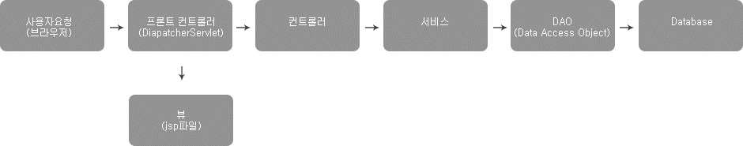
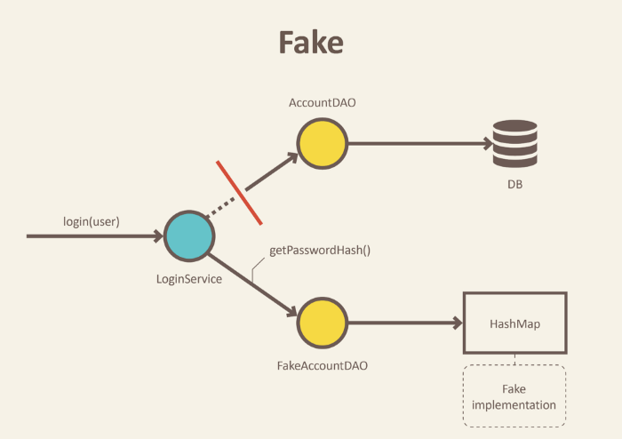

# Repository test
Repository계층은 데이터베이스와 직접적으로 연결되는 계층이다. 또한 비즈니스로직을 거쳐 생성된 엔티티를 CRUD를 통해 데이터베이스에 영속화하는 기능을 하는 계층이다.

따라서 Repository layer에서의 테스트는 이러한 Repository계층이 가지는 역할이 잘 수행되는지 테스트를 해야한다. 


## F.I.R.S.T 규칙
FIRST원칙은 clean code에서 제시된 효율적이고 좋은 단위테스트를 하기위한 5가지 규칙이다.

1. Fast: 테스트는 빠르게 동작하여 자주 돌릴 수 있어야 한다.
2. Independent: 각각의 테스트는 독립적이며 서로 의존해서는 안된다.
3. Repeatable: 어느 환경에서도 반복 가능해야 한다.
4. Self-Validating: 테스트는 성공 또는 실패로 boolean 값으로 결과를 내어 자체적으로 검증되어야 한다.
5. Timely: 테스트는 적시에 즉, 테스트하려는 실제 코드를 구현하기 직전에 구현해야 한다.

빠르게 동작하기 위해서는 테스트는 가벼워야하며 독립적으로 수행되기 위해 다른 계층과 결합이 최소화 되어야한다. 또한 assertion을 통해 테스트의 통과여부를 판단해야한다.

## Repository layer의 테스트 시 필요한 것.

service와의 결합이 존재해서는 안된다.
- 테스트를 빠르게 수행하고 독립적으로 실행되기 위해서 service와의 연결을 제거하고 save(),findById()와 같은 메소드가 잘 작동하고 영속화가 제대로 진행되는지 테스트해야한다.

DB와의 결합은 필요
- Repository layer의 특성상 db와 밀접한 관련이 있다. 그러나 독립적인 테스트를 위해 db에 대한 결합을 끊어버리면 db연결과 데이터 영속화에 대한 테스트를 확인할 수 없다.
- test double을 이용하여 db에 대한 의존성을 제거할 수는 있지만 실제 db환경과 달라 테스트에 통과하더라도 실제 서비스환경에서 제대로 작동하지 않을 가능성이 있다.
- test double을 이용하지 않는 방법에는 임베디드db와 실제 db환경을 구성해 테스트하는 두가지 방법이 있다.
<br>
test double 참고링크 : https://hudi.blog/test-double/

transaction rollback
- 테스트를 반복적으로 여러번 수행하더라도 이전 테스트에 영향을 받지 않도록 하기 위해 테스트가 끝나면 트랜잭션 롤백을 진행해야한다.

# @DataJpaTest

- JPA에 관련된 요소들만 테스트하기 위한 어노테이션으로 JPA 테스트에 관련된 설정들만 적용해준다.
- 메모리상에 내부 데이터베이스를 생성하고 @Entity 클래스들을 등록하고 JPA Repository 설정들을 해준다. 
- @DataJpaTest는 트랜잭션 기능이 추가가 되어있기 때문에 각 테스트마다 테스트가 완료되면 관련한 설정들은 롤백된다.

@AutoConfigureTestDatabase의 'replace' 속성값으로 기본 테스트 db를 변경할 수 있다.
- ANY :  자동 구성 또는 수동 정의 여부에 따라 DataSoruce 교체 (default)
- AUTO_CONFIGURED : 자동 설정된 경우에만 DataSORUCE 교체
- NONE : 기본 DataSorucr를 교체하지 않는다.
```java
@DataJpaTest
@AutoConfigureTestDatabase(replace = Replace.NONE)
class RepositoryTest {

}
```
# BDD란?

BDD(Behavior Driven Development)란 비즈니스 중심의 행위 주도 개발 방법론을 말한다.

테스트 대상의 상태 변화를 테스트하는 것이고 시나리오를 기반으로 테스트하는 패턴을 권장한다.

TDD(Test-Driven Development)는 단위 테스트 코드 자체에 중점을 두지만, BDD는 TDD를 포함하며 시나리오 기반이다 보니 큰 관점에서 비즈니스 요구 사항 중심의 개발 방법론이라고 보는 것이다.

예를들어 controller에서 특정 service 메소드가 예외를 던지거나 dto를 반환할 수 있고 요청이 들어올 때 요청바디의 데이터가 유효성검사를 실패하거나 성공하거나 여러가지 상황이 있을 수 있는데 이러한 시나리오를 가정하여 각 상황에 대한 테스트를 진행하는 것이다.

## Given-When-Then 패턴

- Given : 테스트 메서드에다가 시나리오 진행에 필요한 조건을 미리 설정해두는 단계이다. 
- When : 실제 테스트를 진행하는 단계로 테스트의 결과를 받아온다.
- Then : 테스트의결과를 검증하는 단계. when단계에서 나온 결과값이 올바른지 검증하는 단계이다.

```java
@Test
@DisplayName("유저 회원가입 성공")
public void addUserTest1(){
    //given
    when(userRepository.existsByEmail(any())).thenReturn(false);

    //when
    userService.addUser(addUserReqDTO);
    User user = addUserReqDTO.toEntity(addUserReqDTO);

    //then
    assertThat(user.getEmail()).isEqualTo("test@naver.com");
    assertThat(user.getName()).isEqualTo("testName");
    assertThat(user.getPassword()).isEqualTo("1234");
    verify(userRepository).save(any());
}
```

그런데 given 부분을 보면 Mockito.when() 메서드를 사용하고 있다. 네이밍 규칙 관점에서 보면 충분히 혼동을 줄 수 있다. 그래서 이 혼동을 없애고자 등장한 것이 BDDMockito이다.

```java
@Test
@DisplayName("유저 회원가입 성공")
public void addUserTest1(){
    //given
    given(userRepository.existsByEmail(any())).willReturn(false);

    //when
    userService.addUser(addUserReqDTO);
    User user = addUserReqDTO.toEntity(addUserReqDTO);

    //then
    assertThat(user.getEmail()).isEqualTo("test@naver.com");
    assertThat(user.getName()).isEqualTo("testName");
    assertThat(user.getPassword()).isEqualTo("1234");
    verify(userRepository).save(any());
}
```

# Repository 테스트 코드
```java
@DataJpaTest
@TestPropertySource("classpath:application-test.properties")
public class UserRepositoryTest {

@Autowired
private UserRepository userRepository;

private User user;
@BeforeEach
void beforeEach(){
    user = User.builder()
            .email("test@naver.com")
            .name("testName")
            .password("1234")
            .build();
}

@Test
@DisplayName("회원 저장 성공")
public void addUserTest(){

    //when
     User user = userRepository.save(this.user);

    //then
    assertThat(user.getEmail()).isEqualTo("test@naver.com");
    assertThat(user.getName()).isEqualTo("testName");
    assertThat(user.getPassword()).isEqualTo("1234");

}

@Test
@DisplayName("회원 존재여부 쿼리성공")
public void existUserTest(){
    //given
    userRepository.save(this.user);

    //when
    boolean notExistTest = userRepository.existsByEmail("test1@naver.com");
    boolean existTest = userRepository.existsByEmail("test@naver.com");

    //then
    assertThat(notExistTest).isFalse();
    assertThat(existTest).isTrue();
}

```