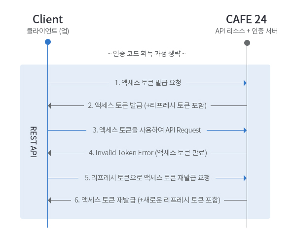

# Access Token의 문제점

1. 보안
   
- Access Token을 사용한 인증방식의 문제는 제 3자에게 토큰을 탈취당할 경우 제 3자가 access token의 계정에 대한 접근권한을 가지게 되며 토큰을 서버에서 보관하고 있지 않기때문에 토큰의 유효기간이 만료되기 전까지 기다리기만 해야한다.

2. 잦은 로그아웃

- 이러한 탈취당할 위험이 있기때문에 Access Token의 유효기간을 짧게하는 것이 일반적이다. 그러나 유효기간이 짧으면 사용자가 유효기간이 만료될 때마다 로그인을 해야하는 귀찮음이 생긴다. 

이러한 Access Token의 단점을 해결하기 위해 Refresh Token이 등장하게 된다.

# Refresh Token

### 목적
- Refresh Token의 목적은 Access Token의 유효 기간을 짧고, 자주 재발급 하도록 만들어 보안을 강화하면서도 사용자에게 잦은 로그아웃 경험을 주지 않도록 하는 것이다.

- Access Token은 리소스에 접근하기 위해서 사용되는 토큰이라면, Refresh Token은 기존에 클라이언트가 가지고 있던 Access Token이 만료되었을 때 Access Token을 새로 발급받기 위해 사용한다.

### 유효 기간
- Refresh Token은 Access Token 대비 긴 유효 기간을 갖는다. Refresh Token을 사용하는 상황에서는 일반적으로 Access Token의 유효기간은 30분 이내, Refresh Token의 유효기간은 2주 정도로 설정한다고 한다. 당연히 서비스 성격에 따라 적절한 유효기간을 설정 해야한다.


### 동작 방식
   


### redis
리프레시 토큰 개념을 활용하려면, 불가피하게 서버측에서 토큰 정보를 저장할 수 있는 곳이 필요하다.

따라서 redis를 이용하여 refresh token을 key-value 쌍으로 저장하여 관리한다.

레디스는 key-value 쌍으로 데이터를 관리할 수 있는 데이터 스토리지이다. 모든 데이터를 메모리에(메인 메모리인 RAM) 저장하고 조회하는 in-memory 데이터 베이스이기 때문에 다른 DB들보다 빠르고 가볍다는 장점이 있다.

### refresh token의 탈취

- Access Token이 탈취되는 문제점을 막기위해 refresh Token을 사용하여 Access Token의 발급을 자주하도록 만들었다. 그러나 만약 refresh token이 탈취당한 경우에는 공격자가 이 refresh token을 통해 access token을 계속 발급받아 사용할 수 있다. 
- 따라서 refresh token을 한번사용하고 refresh token을 통해 access token을 발급하면 refresh token을 재발급하여 redis에 저장하는 RTR (Refresh Token Rotation) 방식을 사용한다.
- 이런 방식을 사용하면, 이미 사용된 Refresh Token을 사용하게 되면 서비스측에서 탈취를 확인하여 조치할 수 있게된다.


- RTR을 사용한다면 Refresh Token을 1회 사용하고 버리게 되어 더 안전하게 사용할 수 있지만, 사용하지 않은 Refresh Token이 탈취당한다면 공격자는 이를통해 Access Token을 1번 발급받을 수 있다. 
- 따라서 refresh token이 탈취당할 경우 피해가 확인되기 전까지는 서버에서 보안작업을 할 수 없다는 단점이 있다. 따라서 XSS나 CSRF와 같은 공격을 통해 토큰이 탈취당하지 않도록 안전하게 보관해야한다.

XSS,CSRF 참고링크: https://securitymanjoseph94.tistory.com/m/12

# 구현

```java
public Object login(LoginResDTO loginResDTO){

    // login 로직

    String accessToken = jwtProvider.createAccessJwt(loginResDTO.getUserId());
    String refreshToken = jwtProvider.createRefreshJwt(loginResDTO.getUserId());

    refreshTokenRepository.saveRefreshToken(userId, refreshToken);

    return TokenReq.Builder()
            .accessToken(accessToken)
            .refreshToken(refreshToken)
            .build()
}


public String createRefreshJwt(long userId) {
        Date now = new Date();
        Date expiration = new Date(now.getTime() + Duration.ofDays(30).toMillis());
        return Jwts.builder()
                .claim("userId", userId)
                .setIssuedAt(now)
                .setExpiration(expiration)
                .signWith(SignatureAlgorithm.HS256, Secrets.JWT_REFRESH_SECRET_KEY)
                .compact();
}

public class JwtAuthorizationFilter extends OncePerRequestFilter {

    @Autowired
    private JwtTokenProvider jwtTokenProvider;

    @Autowired
    private RefreshTokenService refreshTokenService;

    @Override
    protected void doFilterInternal(HttpServletRequest request, HttpServletResponse response,
                                    FilterChain filterChain) throws ServletException, IOException {

        String token = jwtTokenProvider.extractToken(request);

        if (token != null && jwtTokenProvider.validateToken(token)) {
            
            if (jwtTokenProvider.isRefreshToken(token)) {
                handleRefreshToken(token, request);
            }
            else{
                handleValidToken(token);
            }
        }

        filterChain.doFilter(request, response);
    }

    private void handleValidToken(String token) {
        String username = jwtTokenProvider.getUsernameFromToken(token);

        UserDetails userDetails = new CustomUserDetailsService().loadUserByUsername(username);

        UsernamePasswordAuthenticationToken authenticationToken =
                new UsernamePasswordAuthenticationToken(userDetails, null, userDetails.getAuthorities());
        SecurityContextHolder.getContext().setAuthentication(authenticationToken);
    }

    private void handleRefreshToken(String token, HttpServletRequest request) {
        String username = jwtTokenProvider.getUsernameFromToken(token);

        Optional<RefreshToken> storedRefreshToken = refreshTokenService.getRefreshTokenByUsername(username);

        if (storedRefreshToken.isPresent() && storedRefreshToken.get().getToken().equals(token)) {
            // Redis에서 리프레시 토큰 제거
            refreshTokenService.deleteRefreshToken(username);

            // 새로운 액세스 토큰 및 리프레시 토큰 발급
            String newAccessToken = jwtTokenProvider.generateAccessToken(new CustomUserDetailsService().loadUserByUsername(username));
            String newRefreshToken = jwtTokenProvider.generateRefreshToken();
            refreshTokenService.saveRefreshToken(username, newRefreshToken);

            // 응답 헤더에 새로 발급한 토큰을 설정
            response.setHeader("Authorization", "Bearer " + newAccessToken);
            response.setHeader("Refresh-Token", newRefreshToken);
        }
    }
}

```