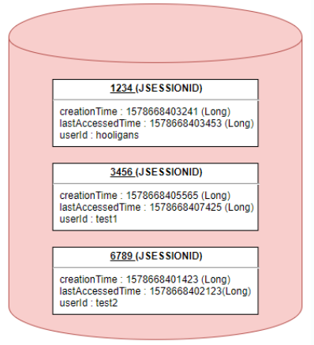

# 시큐리티 해보자고~

# 다양한 로그인 기법

> 세션: 데이터베이스에 저장됨
토큰: 클라이언트 측에만 저장됨
> 

## 세션 방식

<aside>
💡 서버에 ‘로그인이 되어있음’이 지속되는 것
→ Stateful하다!

</aside>

세션은 비밀번호 등 클라이언트의 민감한 인증 정보를 브라우저가 아닌 서버 측에 저장하고 관리한

다. 서버의 메모리에 저장하기도 하고, 서버의 로컬 파일이나 데이터베이스에 저장하기도 한다.

사용자에게 인증 정보를 저장하도록 두지 않는다.

- 세션 객체의 형태
    
    
    
    세션 객체는 Key에 해당하는 SESSION ID와 이에 대응하는 Value로 구성되어 있다.
    
    Value에는 세션 생성 시간, 마지막 접근 시간 및 User가 저장한 속성 등 이 Map 형태로 저장된다.
    

- 세션 기반 인증방식

1. 유저가 웹사이트에서 로그인하면 세션이 서버 메모리(혹은 데이터베이스) 상에 저장된다. 이때, 세션을 식별하기 위한 Session Id를 기준으로 정보를 저장한다.
2. 서버에서 브라우저에 쿠키가 Session Id를 저장한다.
3. 쿠키에 정보가 담겨있기 때문에 브라우저는 해당 사이트에 대한 모든 Request에 Session Id를 쿠키에 담아 전송한다.
4. 서버는 클라이언트가 보낸 Session Id 와 서버 메모로 관리하고 있는 Session Id를 비교하여 인증을 수행하고, 일치하면 인가를 수행한다.

장점:

- 서버에 저장하기 때문에 관리가 매우 편하고 효율적이다.
- 구현이 명확하며 실제 서버에서 로그인 상태를 확인하기 유용하다.

단점: 

- 서버에서 클라이언트의 상태를 모두 유지하고 있어야 하므로, 클라이언트 수가 많으면 메모리나 DB에 부하가 심하다 (DB의 과부하)
- 멀티 디바이스 환경(모바일, 공동 사용 등)에서 로그인 시 중복 로그인 처리가 되지 않는 등의 신경 써야 할 부분들이 발생한다.
- 사용자가 많아지는 경우 로드 밸런싱을 사용한 서버 확장을 이용해야 하는데 이 때 세션의 관리가 어려워진다.

*로드 밸런싱: 

서버가 처리해야 할 업무 혹은 요청(Load)을 여러 대의 서버로 나누어(Balancing)처리하는 것을 의미한다.

## Token 방식

토큰 기반 인증 시스템은 클라이언트가 서버에 접속을 하면 서버에서 해당 클라이언트에게 인증 

었다는 의미로 '토큰'을 부여한다. 

이 토큰은 유일하며 토큰을 발급받은 클라이언트는 또 다시 서버에 요청을 보낼 때 요청 헤더에 토큰을 심어서 보낸다. 

서버에서는 클라이언트로부터 받은 토큰을 서버에서 제공한 토큰과의 일치 여부를 체크하여 인증 과정을 처리하게 된다.

Token 기반 인증의 방법으로 많은 웹 서버들은 JWT(Json Web Token)를 사용한다.

- 토큰 인증 방법
    
    
    
    1. 유저가 로그인을 요청하고 id, pw 정보가 유효하다면 서버에서 Secret Key를 사용해서 유저에게 **토큰을 발급**한다.
    2. 클라이언트는 발급 받은 토큰을 저장하고, 서버에서 요청 할 때 마다, 해당 **토큰을 함께 서버에 전달**한다.
        - 사용자가 받는 토큰의 생김새
            
            
            
        - 인코딩 또는 암호화된 3가지 데이터를 이어 붙인 것으로, 각 부분 마다 갖고 있는 데이터가 다르다.
            
            header: 토큰을 어떻게 검증(Verify)하는가에 대한 내용을 담고 있다.
            
            payload: 토큰에 담긴 사용자 정보 등의 데이터가 저장 되어있다.
            
            누가 누구에게 발급했는지, 유효기간, 사용자에게 이 토큰을 통해 공개하기 원하는 내용(ex:사용자의 닉 네임, 서비스 상의 레벨, 관리자 여부 등)
            
            ⇒ 따라서 사용자가 받아서 갖고 있는 토큰 자체에 이런 정보들이 들어 있으므로, 서버가 요청마다 데이터베이스에서 찾아야 할 것들이 줄어든다.
            
            signature: 부호화 시킨 header와 payload를 가지고 발급해준 서버가 지정한
            
            **secret key로 암호화** 시켜 토큰을 변조하기 어렵게 한다.
            
    3. 서버는 **토큰을 검증** 하고, **요청에 응답**한다.
    
- 장점:
    - 클라이언트에 토큰이 저장되어 있기 때문에 서버의 메모리에 부담이 되지 않으며 Scale에 있어 대비책을 고려할 필요가 없다.
    - 멀티 디바이스 환경에 대한 부담이 없다.
- 단점:
    - 암호화가 풀릴 가능성을 배제할 수 없다.=> 암호화가 풀리더라도 토큰을 사용할 수 없도록 만료기간을 짧게 설정한다.(짧게는 5, 6분. 길게는 1시간)
    - payload 자체는 암호화 되지 않고 base64로 인코딩한 데이터이므로, 중간에 payload를 탈취하면 디코딩을 통해 데이터를 볼 수 있다. 따라서 JWE를 통해 암호화 하거나, payload에 중요한 데이터를 넣지 않아야 한다.

+Basic 인증 방식과 Bearer 인증 방식

Basic 인증 방식:

가장 기본적인 인증 방식이다. 

인증 정보로 사용자 ID, 비밀번호를 사용해요. base64로 인코딩한 “사용자ID:비밀번호” 문자열을 Basic과 함께 인증 헤더에 입력한다.

Base64는 쉽게 복호화할 수 있다. 

→ 단순 base64 인코딩된 사용자 ID와 비밀번호를 HTTP로 전달하면 요청의 보안이 보장되지 않다. →Basic 인증을 사용하는 요청은 꼭 HTTPS, SSL/TLS로 통신해야 안전하다.

Bearer 인증 방식:

Bearer 인증 방식은 OAuth2.0 프레임워크에서 사용하는 토큰 인증 방식이다. “Bearer”은 소유자라는 뜻인데, “이 토큰의 소유자에게 권한을 부여해줘”라는 의미로 이름을 붙였다. Bearer와 토큰을 인증 헤더에 입력한다.

암호화할 때 충분히 어려운 암호화 알고리즘을 써서 보안에 유리하지만, 토큰 자체가 탈취당하는것에 대해선 취약한 편이다.

